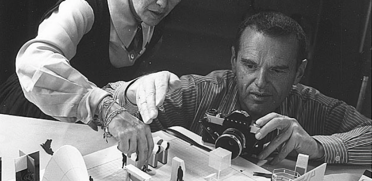
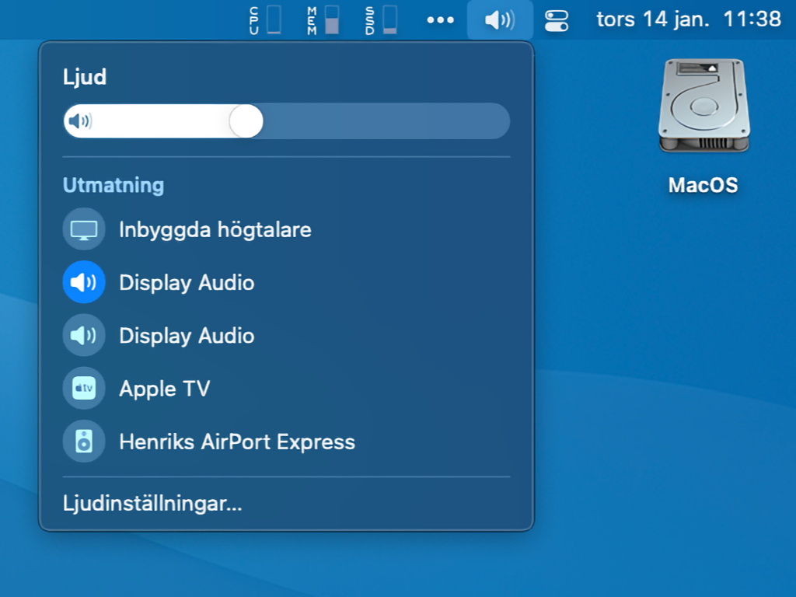
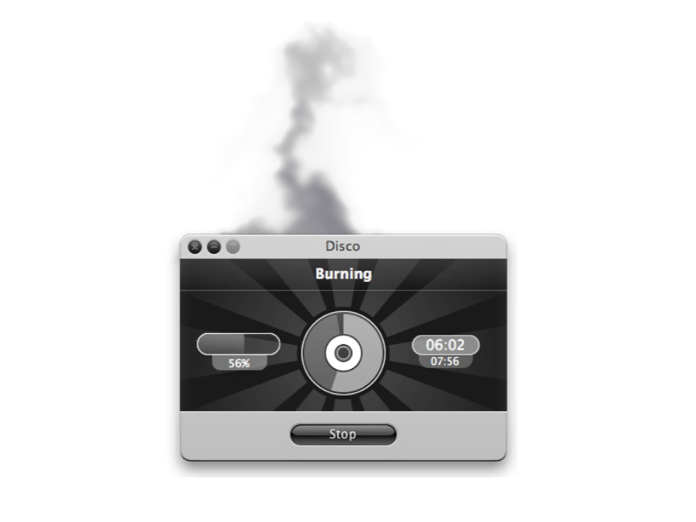

# Mikrointeraktion

En introduktion till mikrointeraktion

---

## Introduktion

- Detta material är baserat på Dan Saffers bok från 2013:
    - Saffer, D. & Norman, D. (2013). Microinteractions - Designing with details, Beijing: O’Reilly. ISBN: 9781491945926
- Boken är underlag till kursens seminarie angående mikrointeraktion, och är således obligatorisk läsning (ca 140 sidor)

---

## Funktionalitet

- Är menad att uppfylla användares behov och/eller önskemål
- Funktionalitet kan..
    - Beskrivas via exempelvis kravspecifikation
    - Utvärderas via användartester

---

### Beskrivning

- Saffer (2014, s. 5) menar att funktionalitet är:
    - Mångsidig
    - Har flera användarfall
    - Menade för längre användaresessioner 
    - fokuskrävande
    - Tämligen komplicerade

---

### Problematik

- Funktionalitet beskriver vad, men inte hur
- Funktionalitet kan således brytas isär i mindre komponenter i syfte att beskriva hur aktuell funktionalitet skall..
    - Användas av användaren
    - Presenteras för användaren

---

### Exempelscenario

- **Problem:** Användare har behov att veta aktuell tid, när- och varsomhelst
- **Lösning:** Konstruera funktionalitet som visar aktuell tid
    - Hur?
        - Analogt
            - Färg och form på urtavla?
        - Digitalt
            - 12-timmars- eller 24-timmarsformat?

---



> The details are not the details. These make the design.

\- Charles Eames

---

## Mikrointeraktion

> Microinteractions are contained product moments that revolve around a single use case — they have one main task.

\- Dan Saffer, 2014

---

### Beskrivning

- Enligt Saffer (2014, s. 5) är microinteraktion bra på att:
    - Genomföra en sak
    - Sammankoppla enheter
    - Interagera med isolerad data
    - Hantera en pågående process
    - Justera en inställning
    - Förhandsgranska eller skapa mindre dataset
    - Aktivera eller avaktivera funktionalitet

---

#### Genomföra en sak

- **Gilla**; *processen med att gilla något på sociala medieplattformar, består vanligtvis av en "klick" eller "knackning".*

---

#### Sammankoppla enheter

- **Parkoppling**; parkoppla enheter genom "beröring" via NFC[^1].
- **Dela**; dela bild och/eller ljud till extern enhet via (trådlöst) nätverk.

[^1]: Near Field Communication (NFC) - överföringsmetod som under korta sträckor kan användas för kontaktlöst utbyte av information.

---

#### Interagera med isolerad data

- **Filväljare**; *exempelvis vid uppladdning av bild till sociala mediaplattformar - valet av bild(er) sker i ett enskilt läge.*

---

#### Hantera en pågående process

- **Registeringsprocess**; *ge användaren återkoppling gällande den information som tillhandahålls - exempelvis huruvida lösenord är starka  eller om användarnamn är upptagna.*
- **Steg**; *dela upp en längre process i flera mindre sektioner.*

---

#### Justera en inställning

- **Volym**;  *ljustera aktuell enhets ljudvolym via reglage.*

---



*Fig. Exempel på microinteraktion från MacOS ljudvolymsreglage.*

---

#### Förhandsgranska eller skapa mindre dataset

- **Chattkonversation**; *läs och/eller skriv textmeddelande.*
- **Framgång**; *illustrera framgång och/eller status av pågående process - exempelvis i applikationsikonen.*

---

#### Aktivera eller avaktivera funktionalitet

- **Växla läge**; *en växelknapp (fysisk eller digital) som aktiverar eller avaktiverar något.*

---

### Beståndsdelar

- Microinteraktion är uppbygd kring fyra beståndsdelar:
    - Trigger: *Vad som aktiverar en microinteraktion*
    - Rules: *Det regelverk som användaren måste följa*
    - Feedback: *Den information som förmedlas som resultat av microinteraktionen*
    - Loops Modes: *Delmoment och återkommande interaktion*

---

#### Trigger

- Enligt Saffer (2014, ss. 26-48) kan triggers kategoriseras i två kategorier:
    - Manuell: *aktiveras utifrån användarens önskemål eller behov (direkt eller indirekt)*
    - System: *användarens systemkonfiguration är i ett tillstånd som påkallar en microinteraktion*

---

##### Manuell

- En ”manual trigger” aktiveras som en konsekvens av användarens interaktion
- Tre designprinciper för ”manual triggers”:
    - **Aktiveras vid efterfrågan eller behov;** *mekanismen styrs utifrån användaren, antingen via direkt interaktion eller som en konsekvens av användarens beteende*
    - **Enhetligt beteende;** *interaktion resulterar i samma process och beteende, oavsett hur många gånger mekanismen aktiveras*
    - **För data vidare;** *om möjligt, ge förhandsinformation innan interaktion påbörjas och följ upp med återkoppling kring processen*

---

##### System

- En ”system trigger” kan aktiveras på grund av konfigurerad mjukvara, alternativt tillstånd av aktuell hårdvara
- Exempel på vanliga tillstånd som kan aktivera en ”system trigger”:
    - **Fel;** *informerar användare, alternativt begära åtgärd*
    - **Plats;** *lokal eller global förändring av position*
    - **Inkommande data;** *exempelvis epost, textmeddelande eller push-notiser*
    - **Intern data;** *exempelvis alarm eller påminnelser*
    - **Andra microinteraktioner;** *exempelvis steg för steg instruktioner*
    - **Andra människor;** *sociala händelser som aktiverar möjlighet till mikrotransaktioner*

---

#### Rules

- Regler dikterar villkor för:
    - vad som skall ske då användaren aktiverar en mekanism
    - vilken nivå av kontroll som användaren besitter över händelseförloppet
    - ordningsföljden av den process som påbörjats
    - vilken data som används under processens gång
    - vilka parametrar och algoritmer som ingår i interaktionsprocessen
    - vilken återkoppling som ges och när den ges
    - vilket skede som interaktionsprocessen befinner sig i
    - om interaktionsprocessen återupprepas och hur ofta
    - vad sker när interaktionsprocessen är slutförd
- Användare måste ha en tydlig förståelse för regelverket bakom mekanismer; *en förutsättning för korrekt användning av produkten*
- Bristfällig förmedling, eller inkonsekvent hantering av regelverk, resulterar vanligtvis i felaktiga användningsmönster och/eller irritation och frustration hos användaren; *regler skall därför:*
    - Förbli konsekventa
    - Förbli enkla (eller roliga) att förstå och följa inom den kontext som erbjuds
    - Erbjuda en god start för användaren

---

#### Feedback

- Då en applikations regelverk inte är visuellt påtaglig för användaren, måste de göras tydliga via återkoppling (feedback)
- Återkoppling behöver inte:
    - vara grafisk, kan representeras av annat (ljud, vibration, etc..)
    - representeras av ett eget element, kan bruka andra existerande element för att förmedla sitt budskap.
    - vara strikt datavetenskaplig. Tillåt ”mänsklig återkoppling”, något som vi som människor kan relatera till.

---



*Fig. Disco av Austin Sarner och Jasper Hauser (2006). En applikation för att bränna CD- och DVD-skivor. Då mjukvaran skriver till CD/DVD, kommer det rök från applikationen. Användaren kan interagera med röken genom att blåsa i tillgänglig mikrofon.*

---

#### Loops & Modes

- Den sista beståndsdelen av mikrointeraktioner består av två komponenter:
    - Loops
    - Modes

---

##### Loops

- Iteration (loops) avgör livslängden för microinteraktioner och kan enligt Saffer (2014, ss. 114-115) delas in i fyra kategorier:
    - Count-controlled (for)
    - Condition-controlled (while)
    - Collection-controlled
    - Infinite
- Används för att påminna om mikrointeraktion eller successivt reducera, eller avveckla deras inverkan

---

###### Count-controlled

- Iteration som baserats på ett förbestämt antal iterationer

```javascript
for (var i = 0; i < 5; i++) {
    console.log("loop");
}
```

*Fig. Återupprepning som baseras på en förbestämd längd.*

---

###### Condition-controlled

- Iteration som återupprepas fram till att ett, eller flera, villkor är uppfyllda

```javascript
while (i < 5) {
    console.log("loop");
    i++;
}
```

*Fig. Återupprepning som baseras på ett villkår.*

---

###### Collection-controlled

- Iteration som baserats på ett förbestämt, eller användarkonstruerat dataset

```javascript
var loops = [0, 1, 2, 3, 4];
while (loops.length) {
  console.log("loop");
  loops.shift();
}
```

*Fig. Återupprepning som baseras på en samling.*

---

###### Infinite

- Iteration som aldrig slutar

```javascript
while(1) {
    console.log("loop");
}
```

Fig. *Återupprepning som aldrig slutar.*

---

##### Modes

- Lägen (modes) är en avvikelse eller förgrening av det övergripande regelverket och bör därför undvikas (om möjligt)
- Inställningslägen är vanligt förekommande och svåra att undvika
- Om flera lägen är nödvändiga, försök att:
    - bevara föregående läges aktuella tillstånd
    - använda ”snabba växellägen” (spring-loaded)

---

## Sammanfattning

- Mikrointeraktion är avskald funktionalitet som dedikerats till ett användningsscenario
- Mikrointeraktion består av: triggers, rules, feedback och loops & modes
- Att designa mikrointeraktioner är att fokusera på detaljer som förstärker användarupplevelsen

---

## Referenser

- Saffer, D. & Norman, D. (2014). Microinteractions - Designing with details, Beijing: O’Reilly. ISBN: 9781491945926