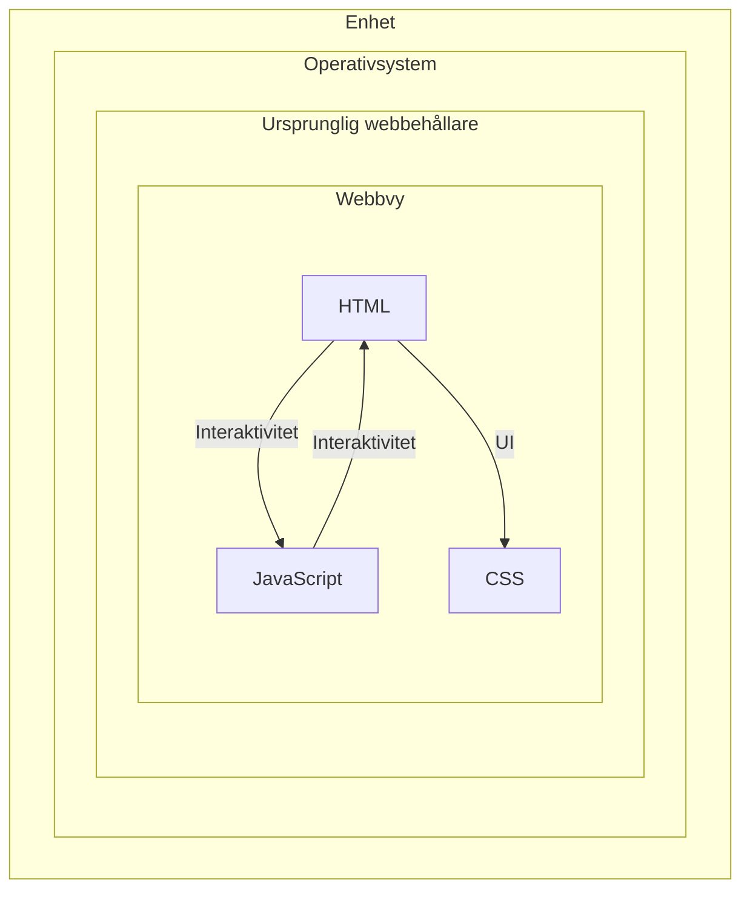
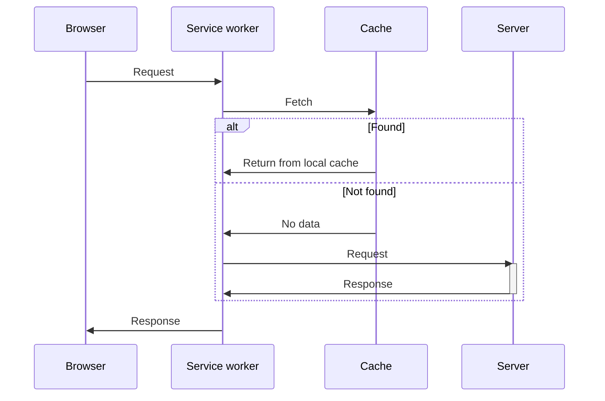

# Utvecklingsmiljö

En introduktion till plattformsoberoende applikationsutveckling med NodeJS, V8 och Electron.

---

## Introduktion

- Historiskt sett har webbteknik setts som exklusivt för webbläsare; *webbteknik används för att skapa webbsidor och -tjänster*
- Webbteknik kan användas för att utveckla mobil- och skrivbordsapplikationer

---

## Applikationstyper

- Applikationer kan utvecklas med ett flertal varierande teknologier:
  - Ursprunglig
  - Hybrid
  - Webb

---

### Ursprunglig

- Ursprunglig teknologi är sådan som är direkt förkoppad med ett specifikt operativsystem och/eller hårdvaruplattform
- Operativsystemtillverkare erbjuder utvecklingspaket[^1] i syfte att möjliggöra och understödja mjukvaruutveckling för den specifika plattformen

[^1]: Software Developer Kit (SDK) - en uppsättning utvecklingsverktyg som syftar att hjälpa tredejepartsutvecklare att utveckla, och felsöka applikationer för en specifik plattform; exempelvis så som hårdvaruplattform, operativsystem, mjukvaruramverk eller spelkonsol.

---

#### Fördelar

- **Enhetligt gränssnitt**; *ursprunglig mjukvara använder vanligtvis gränssnittskomponenter som görs tillgängliga via aktuell plattforms SDK.*
- **Tillgång till lågnivå-APIer**; *ursprungliga applikationer är inte begränsade av samma säkerhetsrestriktioner och/eller applikationskontexter som andra typer av applikationer. Vanligtvis ges ursprungliga applikationer tillgång till aktuellt operativsystems interna processer via långivå-APIer.*
- **God prestanda**; *då ursprungliga applikationer exekveras direkt under aktuellt operativ- eller hårdvarusystem, resulterar det i en förbättrad prestanda gentemot applikationer som exekveras högre upp i mjukvaraustacken.*

---

#### Nackdelar

- **Tidskrävande att utveckla**; *då ursprungliga applikationer skrivs i låg- och/eller högnivåspråk som har en nära anknytning till aktuellt operativsystem och hårdvara, resulterar detta i en mer tidskrävande process gentemot applikationer som utformas med skriptspråk.*
- **Begränsade till aktuell plattform**; *då en ursprunglig applikation har ett starkt beroende till aktuell plattform, kan den inte överföras till andra plattformar utan att först skrivas om. En omskrivning innebär framtagning av ny källkod, samt utformning av nytt gränssnitt.*

---

### Hybrid

- En hybridapplikation kobinerar teknologi från ursprunglig utveckling med webbutveckling

*Fig.  Beskriver strukturen av en hybridapplikation.*

---

#### Fördelar

- **Hög portabelitet**; *då applikationens källkod består av HTML, CSS och JavaScript, kan samma källkod användas för flera målplattformar. Detta förutsätter att den applikation som representerar hybridapplikationens webbehållare, finns tillgänglig för mer än en dedikerad plattform.*
- **Förhållandevis enkla att utveckla**; *då en hybridapplikation består av en specialanpassad webbsida, är de förhållandevis enkla att utveckla (gämfört med utveckling av ursprungliga applikationer)*
- **Dynamiskt innehåll**; *det är möjligt att via en hybridapplikation ladda in externt material. Detta innebär att en hybridapplikation kan uppdatera sitt innehåll, utan att den faktiska binärfilen ersätts i samband med manuell uppdateringsprocess. Det skall noteras att då dynamisk inladdning kan klassificeras som en säkerhetsrisk, görs det inte tillgängligt på samtliga plattformar.*

---

#### Nackdelar

- **Försämrad prestanda**; *då hybridapplikationer är beroende av en värdmiljö som ansvarar för rendering och tolkning av källkod, resulterar detta i en högre minnesförbrukning och försämrad prestanda (gämfört med ursprungliga applikationer).*
- **Inbakad källkod**; *Då hybridapplikationer sällan kompilerar sin källkod, görs samtliga resurser (inklusive inbakad multimedia) tillgängliga via applikationens binärfil. Detta gör det svårt att skydda en applikations källkod och filer.*
- **Ursprungliga gränssnittsbibliotek görs inte tillgängliga**; *en hybridapplikation kan inte använda samma gränssnittsbibliotek som ursprungliga applikationer. Detta innebär att hybridapplikationer ofta sticker ut på så sätt att deras gränssnitt inte är identiskt med aktuell plattforms gränsnittsbibliotek. En hybridapplikation använder HTML och CSS för att deklarera gränssnittskomponenter, och är således låsta till vad dessa tekniker kan erbjuda.*

---

### Webb

- Konceptet med att använda webbteknik för att konstruera/simulera ursprungliga applikationer, introducerades av Steve Jobs under Apple Worldwide Developers Conference (WWDC) 2007; *då som svar på avsaknad till möjlighet att utveckla tredjepartsapplikationer till Apples iPhone.*
- Konceptet är numera känt under termen "Progressive Web Apps" (PWA); *en term som myntades av Russell (2015) och innebär:*
  - **Responsiv**; *kan anpassas efter flera formfaktorer.*
  - **Anslutningsoberoende**; *använder en applikationscache som möjliggör att applikationen kan fungera utan åtkomst till Internet.*
  - **Applikationsliknande interaktion**; *baseras på en skalapplikation där innehåll laddas dynamiskt.*
  - **Uppdaterade**; *ser till att uppdatera applikationens tillstånd och innehåll dynamiskt via aktiv bakgrundsprocess.*
  - **Säkra**; *kommunicerar via Transport Layer Security (TLS) i syfte att skydda användarens information.*
  - **Upptäckbara**; *W3C (2020) erbjuder en standard för utvecklare att klassificera en webbplats som "webbapplikation" och därmed tillhandahålla relevant metadata för denna applikation.*
  - **Återkopplar**; *kan använda tekniker som exempelvis push-notiser i syfte att påkalla användarens uppmärksamhet, i samband med relevanta och viktiga händelser inom applikationskontexten.*
  - **Installerbar**; *kan "installeras" via webbläsarledd installationsprocess.* 
  - **Länkbara**; *kan aktiveras och distribueras direkt via hyperlänkar; ingen installationsprocess nödvändig.*

---

#### Fördelar

- **Självständiga**; *kan distrubueras fritt och är inte låsta till regler eller restriktioner av en digital försäljningsplattform. Plattformar som exempelvis App Store och/eller Google Play.*
- **Multiplattform**; om en PWA är skriven efter aktuell webbstandard, skall den fungera likvärdigt oavsett plattform och/eller webbläsare. Det finns inget behov av översättning av källkod, eller omkompilering av binärfil, i syfte att finnas tillgänglig på alternativa plattformar.
- **Dynamiskt innehåll**; *då en applikation är en specialanpassad webbsida, kan innehåll och funktionalitet uppdateras, utan att användaren aktivt måste ladda ned och installera den uppdaterade versionen.*

---

#### Nackdelar

- **Är starkt beroende av webbstandard**; *webbläsartillverkare måste acceptera och enhetligt implementera nödvändig webbstandard i syfte att ge tredjepartsutvecklare möjlighet att skapa PWA. Då PWA, likt "traditionella" webbsidor använder COD-principen [^2], är det viktigt att det finns en tydlig och etablerad standard för hur källkod skall tolkas.*

[^2]:Code On Demand (COD) - teknologi för att distrubuera mjukvara i form av källkod, där källkoden förmedlas via en server, till klienter som senare exekverar den nedladdade källkoden.

---

## Teknologier

- Det finns ett flertal webbaserade teknologier som kan användas för utveckling av skrivbords- och mobilapplikationer; denna föreläsning introducerar två möjliga alternativ:
  - **Electron**; *teknologi för att via webbteknik skapa skrivbordsapplikationer till MacOS, Windows och Linux.*
  - **PWA**; *föreläsningen behandlar ett flertal standardiserade APIer som kan användas för utformning av PWA*.

---

### Electron

- Teknologi för att skapa plattformsoberoende skrivbordsapplikationer med befintlig och standardiserad webbteknik; *teknologin använder..*
  - **Chromium**; *för gränssnittsdesign och layout (HTML och CSS).*
  - **V8**; *för exekvering av JavaScript.*
  - **Node**; *för åtkomst till filsystem och nätverk.*
  - **Externa APIer**; *för åtkomst till tjänster från aktuellt operativsystem.*
- Har utvecklats sedan 2013 och ligger till grund för skrivbordsapplikationer så som Visual Studio Code (VSCode), Facebook Messenger, Twitch, Slack Github Desktop, etc..
- Installeras via NPM (som beskrivs senare i föreläsningsmaterialet)

---

#### Chromium

- Ett Google-sponsrat öppen källkodsprojekt, som ligger till grund för:
  - **Google Chrome**; *Googles primära webbläsare. Chrome-projektet använder sluten källkod och görs därför inte tillgänglig för tredjepartsutvecklare.*
  - **Microsoft Edge**; *Microsofts primära webbläsare som ersätter Microsoft Internet Explorer-serien av webbläsare.*
  - **Opera**; *Norsk webbläsare vars första versioner introducerades 1995. Webbläsarserien är känd för att tidigt introducera funktionalitet som senare kommer att bli industristandard.*
  - **Brave**; *öppen källkodsprojekt som startats av Brendan Eich, mer känd som skaparen av JavaScript.*
- Chromium är en aktuell, men minimalistisk webbläsare; *är dock känd för sin höga minneskonsumtion.* 

---

#### V8

- Är den JavaScript-motor som används av Chromium-baserade webbläsare; *den del av webbläsaren som tolkar och exekverar JavaScript-kod*
- Baseras på JIT[^3]-principen och genererar V8-specifik bytekod utifrån laddad JavaScript-kod

[^3]: Just In Time (JIT) - teknologi som genererar kompilerad maskinkod under exekvering, inte före.

---

#### Node

- Node.js är en öppen källkod-teknologi som baseras på V8 för att exekvera JavaScript utanför kontexten av en webbläsare
- Teknologin introducerades 2009 av Ryan Dahl och...
  - Finns tillgänglig för MacOS, Windows och Linux
  - Använder ett kommandotolksgränssnitt (CLI) och installeras som programmet `node`
  - Exekveras som en bakgrundsprocess inom aktuellt operativsystem
  - Är en populr teknologi för att konstruera serverapplikationer med JavaScript

> node ./script_to_run.js

---

#### Externa APIer

- Electrons exekveringsmiljö erbjuder åtkomst till funktionalitet hos aktuellt operativsystem via JavaScript-APIer; *här följer exempel på funktionalitet:*
  - Dialogrutor
  - Urklipp
  - Notifikationer
  - Filsystem
  - etc..

---

### PWA

- PWA är inte en enskild teknolgi; *det är ett samlingsnamn för systematiskt användning av aktuell webbteknik, men vissa karraktäristiska drag*
- Begreppet är associerat med följande teknologier/arbetsmetoder:
  - Skapapplikation 
  - Service workers

---

#### Skapapplikation

- Designkoncept som syftar till att separera en applikations innehåll (data) från dess användargränssnitt (GUI); *detta uppnås genom att:*
  - **Utforma tom HTML-layout**; webbsidor/applikationsvyer utformas utan innehåll, en webbsida skall enbart representera ett användargränssnitt.
  - **Spara en applikations gränssnitt i cache-minne**; om en applikations användargränssnitt bestående av HTML, CSS, JavaScript (för gränssnittsinteraktivitet) och grafik, sparas i webbläsarens cache-minne, kan innehållet laddas ned en inital gång, för att senare enbart hänvisa till den nedladdade versionen i cache-minnet. Utöver snabbare sidvisningar, resulterar detta i att applikationen, eller delar av applikationen fungerar, eller kan användas, utan fungerande internetuppkoppling.
- W3C (2020) menar att "Web App Manifest"-standarden ger webbutvecklare möjlighet att skapa webbapplikationer som är gämförbara med användarupplevensen av en ursprunglig applikation

---

#### Service Worker

- En händelsestyrd bakgrundsprocess som exekverar ett skript som registrerats mot en ursprungs-URL med tillhörande sökväg (W3C, 2019)
- Fungerar som en "proxy server" på klientsidan och hänvisar externa resursförfrågningar, inom registrerat ursprung, till applikationens cache-minne; *enligt följande logik:*
  - **Om resursen förekommer i cache-minnet**; hämta och använd den version för förekommer i cache-minnet. Inget externt anrop via nätverket är nödvändigt.
  - **Om resursen inte förekommer i cache-minnet**; *genomför en resursförfrågan via nätverket och hämta den resurs som efterfrågas. Efter lyckad hämtning, bör resursen läggas till i det lokala cache-minnet för att undvika att resursen hämtas på nytt.*
- En lyckad implementering av `service worker` innebär att...
  - Statisk information enbart behöver hämtas en gång
  - Att applikationen kan förlita sig på information i cache-minnet då en giltig Internetanslutning inte finns tillgänglig, dvs. applikationen fungerar i nedkopplat läge (offline mode)

---

*Fig. Illustrerar händelseförloppet för resursförfrågningar inom en PWA efter den initala installationen av en `service worker`. Notera hur systemet prioriterar lokal data och således enbart aktiverar servern då det är absolut nödvändigt.*

---

## Sammanfattning

- Webbutvecklare kan med hjälp av befintlig webbteknik skapa hybrid- och webbapplikationer som simulerar användarupplevelnsen av en ursprunglig applikation
- Hybridapplikationer exekveras inom en minimalistisk webbläsarkontext som vanligtvis ger åtkomst till aktuellt operativsystems interna, underliggande system och tjänster, via egna JavaScript-APIer
- Progressiva webbapplikationer kan utformas för att ge en webbsida/-tjänst, möjlighet att erbjuda en användarupplevelse som kan gämföras med den av en ursprunglig applikation

---

## Referenser

Russell, A. (2015). *Progressive Web Apps: Escaping Tabs Without Losing Our Soul*. [online] Medium. Available at: https://medium.com/@slightlylate/progressive-apps-escaping-tabs-without-losing-our-soul-3b93a8561955#.6czgj0myh

W3C (World Wide Web Consortium). (2019). *Service Workers 1*. [online] Available at: https://www.w3.org/TR/service-workers/.

W3C (World Wide Web Consortium). (2020). *Web App Manifest*. [online] Available at: https://www.w3.org/TR/appmanifest/

