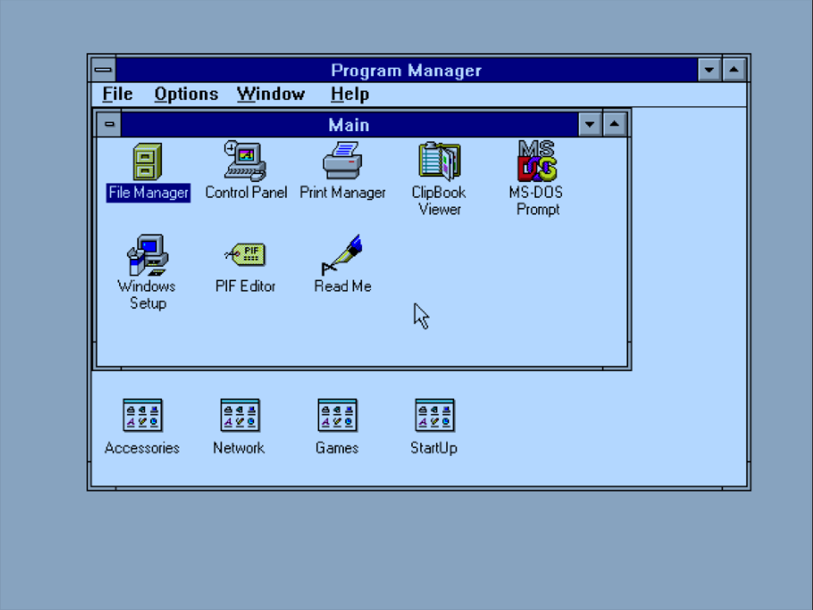
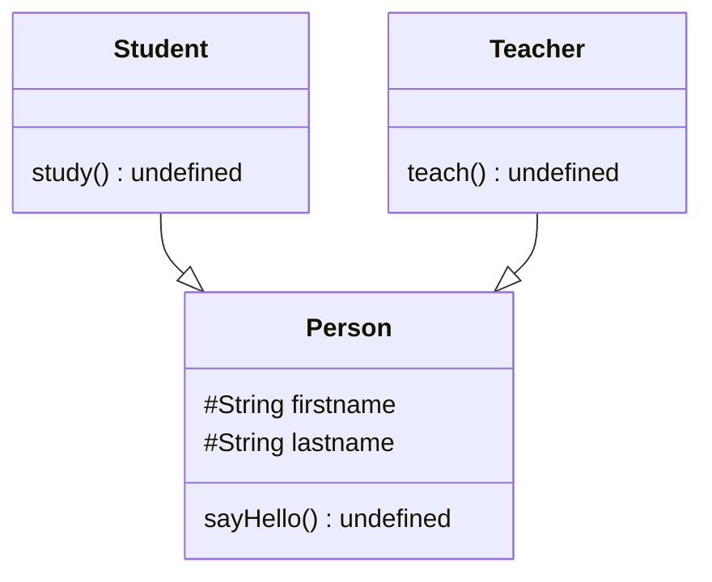
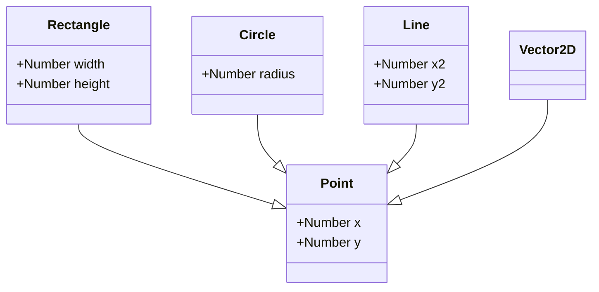

---
# Objektorienterad programmering

En introduktion till objektorienterad utveckling med JavaScript.

---

## Introduktion

- JavaScript är ett prototyp-baserat skriptspråk som ursprungligen var avsett att förbättra användarupplevensen på statiska webbsidor; *vanligtvis genom att tillföra någon form av interaktivitet.*
- JavaScript är ett av världens mest använda programmeringsspråk och används för att skapa webbplatser, -tjänster, servermjukvara, mobil- och skrivbordsapplikationer.
- Språkets svaga typning gör det till ett flexibelt programmeringsspråk, som kan anamma flertalet programmeringsparadigmer.
- Denna föreläsning ger en introduktion till Objektorienterad programmering, samt en introduktion till hur objektorienterade principer kan appliceras på JavaScript; *notera att det är en introduktion och inte en fullständig genomgång.*

---

## Programmeringsspråk

- Används av människor för att utforma instruktioner till maskiner i syfte att skapa applikationer och tjänster.
- Kan delas upp i följande kategorier:
	- Maskinspråk
	- Lågnivåspråk
	- Högnivåspråk

---

### Maskinspråk

- Beskrivs vanligtvis som "datorspråk" och består av ettor och nollor.
- Kan tolkas direkt av datorns CPU, vilket resulterar i snabb exekvering.

```
00110001
01101101
01100101
00110011
00110011
00110011
```

*Fig. Binärkod som då den omkodas till ASCII, tyder: 1me333.*

---

### Lågnivåspråk

- Består av en uppsättning instruktioner som är direkt bundna till aktuell dators CPU.
- Måste översättas (kompileras) innan det kan tolkas av datorns CPU; *denna kompileringsprocess omvandlar lågnivåkod till maskinkod*.
- Ousterhout (1998) menar att komplexiteten av maskinkod, gör den svår att utforma och underhålla.

```
year DB 2021
```

*Fig. Deklarerar en byte med referensman `year`, innehållande värdet 2021, eller 0x7E5 i hexadecimal.*

---

### Högnivåspråk

- Språk där instruktioner utformats efter Engelska språket; *högnivåspråk blir således mer distanserade från datorns maskininstruktioner.*
- Kan delas upp i följande kategorier:
	- Systemspråk
	- Skriptspråk

```javascript
var num = 100;
while(num > 10) {
	num--
}

console.log(num);
```

*Fig. JavaScript är ett exempel på högnivåspråk, något som tydligt kan ses utifrån dess syntax.*

---

#### Systemspråk

- Programmeringsspråk med likvärdigt användningsområde som lågnivåspråk, men där delar av arbetsprocessn automatiserats via en kompilator (Ousterhout, 1998).
- Systemspråk kompileras till körbara program, som kan exekveras inom kontexten av ett operativsystem och/eller hårdvaruplattform.
- Använder "stark typning", villket innebär att all data måste klassificera sitt innehåll genom att associera till en av flera möjliga datatyper .

```c++
#include <iostream>
using namespace std;

int add(int a, int b) {
    return a + b;
}

int main() {
   cout << add(5, 2); 
   return 0;
}
```

*Fig. Program som adderar två heltal; fem och två. Programmet är skrivet i C++ som är ett systemspråk med stark typning.*

---

#### Skriptspråk

- Är beroende av en värdmiljö för tolkning och exekvering av källkod, denna värdmiljö är en produkt av andra programmeringsspråk (Ousterhout, 1998); detta innebär att..
	- Värdmiljön dikterar möjligheter och begränsningar hos aktuell applikation.
	- Aktuell applikation kan inte exekveras utan installerad vårdmiljö, alternativt att värdmiljön "bakas in" med applikationen.
- Skriptkod kompileras inte till en körbar binärfil, utan exekveras istället via:
	- Programtolk
	- JIT-kompilator

---

##### Programtolk

- Mjukvara som tolkar och exekverar skriptkod i realtid; *tolken är det faktiska programmet som exekveras och skriptkoden motsvarar instruktioner som tolken översätter till maskininstruktioner*.
- Skriptspråk görs inte lika effektiva som systemspråk då de tolkas och inte kompileras (Ousterhout, 1998).

---

##### JIT-kompilator

- Begreppet "Just In Time" inom programmering refererat till en exekveringsmiljö som  kompilerar programkod under exekvering; *vanligtvis till någon form av bytekod.*
- Fungerar som en kombination av tolk och kompilator.

---

### Paradigmer

- Inom högnivåspråk förekommer ett antal paradigmer som representerar en teoretisk modell för hur programkod bör, eller ska organiseras och struktureras.
- Ett högnivåspråk kan vara mer eller mindre lämpligt för en specifik paradigm, i vissa fall kan inte språket använda en viss paradigm.
- Exempel på programmeringsparadigmer:
	- Procedurell programmering
	- Funktionell programmering
	- Objektorienterad programmering

---

#### Objektorienterad programmering

- Inom objektorienterad programmering skall..
	- Applikationslogik förenklas genom att finna inspiration från människans omgivning.
	- Applikationer bestå av flera samverkande moduler, där varje modul har ett dedikerat syfte.
	- Generell programkod återanvändas och aldrig repeteras.
- Syftet med objektorienterad programmering är att förenkla logiken bakom en applikation genom att bryta ned den i mindre, samverkande byggstenar som relaterar till verklighetsbaserade objekt; *objektorienterad programmering handlar om att skriva "människovänlig" programkod, snarare än "maskinvänlig."* 

---

## Terminologi

- Begrepp inom objektorienterad programmering:
	- Objekt
	- Egenskap
	- Metod
	- Inkapsling
	- Klass
	- Arv
	- Polymorfism

---

### Objekt

- Representerar en specifik sak, entitet eller plats, inom kontexten av en mjukvaruapplikation; *detta innebär att typning spelar en betydande roll för objektorienterad programmering.*
	- En **bil** är en sak, därför ett objekt.
	- Alla **bilar** kan identifieras som en *bil*.

```JavaScript
var car = new Car();
console.log(obj instanceof Car); // true
```

*Fig. Variabeln `car` lagrar en referens till en instans av klassen `Car`. Operatören `new` används för att skapa ett nytt objekt utifrån hänvisad klass. Det är möjligt att kontrollera huruvida ett objekt härstammar från en specifik klass, detta via operatören `instanceof`.*

---


*Fig. Super Mario Bros. (1985).*

<!-- Övning: Även om Super Mario Bros inte är skrivet med objektorienterad källkod, försök att strukturera spelets innehåll efter objektorienterad teori. Vad finns det för objekt? -->

---



*Fig. Microsoft Windows 3.11. (1993)*

<!-- Övning: Då objektorienterad programmering är menad att simulera den verkliga världen, kan objektorienterad teroi relativt enkelt appliceras på spel. En skrivbordsapplikation kan vara svårare att organisera. Försök att dela upp Microsoft Windows 3.11 i objekt.  -->

---

### Egenskap

- Beskrivande drag hos ett objekt
	- Bilens *färg* är **röd**.
- I praktiken är en egenskap en variabel som deklareras som en del av ett objekt.
	- Egenskaper görs tillgängliga via punktnotation:

```JavaScript
car.color = 0xffff0000;
```

*Fig. Objektet `car` får egenskapen `color` satt till röd i hexadecimal.*

---

### Metod

- Något som objektet kan göra (verb).
	- Bilen kan **tuta**.
- I praktiken är en metod en funktion som deklarerats som en del av ett objekt.
	- Metoder görs tillgängliga via punktnotation

```JavaScript
car.honk();
```

*Fig. Metoden `honk` anropas via objektet `car`*

---

### Inkapsling

- Vanligtvis uppstår delar av ett objekt som inte behöver göras tillgängligt utanför objektets egna omfång; *exempelvis egenskaper och metoder som relaterar till interna processer.*
- Exempel på vanligt förekommande åtkomstmodifierare:
	- Publik
	- Intern
	- Skyddad
	- Privat
- Notera att JavaScript saknar implementerat stöd för åtkomstmodifierare, men det finns sätt att uppnå liknande resultat.

---

#### Publik

- Innehåll som görs tillgängligt inom och utanför det aktuella objektet, dvs kan alltid anropas då det finns en giltigt objektreferens.
- Förknippas vanligtvis med nyckelordet `public`.

---

#### Intern

- När åtkomst begränsas till det egna omfånget, samt från objekt som härstammar från samma paketstruktur.
- Mycket användbart koncept vid utformning av dedikerade moduler, och/eller system som består av flera samverkande objekt.
- Möjliggör att viss information görs tillgänglig inom en viss grupp av relaterade objekt, helt oberoende av arv.
- Programspråk som stödjer denna åtkomstdeklaration.
- Förknippas vanligtvis med nyckelordet `internal` eller `package`.

---

#### Skyddad

- Information görs tillgänglig inom det egna objektet samt andra objekt som ingår i arvsledet, dvs. eventuella barnklasser.
- Förknippas vanligtvis med nyckelordet `protected`.

---

#### Privat

- Information gör exklusiv till det egna objektet.
- Används för att skydda ett objekts interna processer från att felaktigt manipuleras utifrån det egna omfånget.
- En tumregel är att använda privat åtkomstdeklaration som sitt standardalternativ.
- Förknippas vanligtvis med nyckelordet `private`.

---

### Klass

- Klasser representerar en teoretisk mall för en tilltänkt datatyp.
- Klasser används för att skapa objekt via instansiering, vanligtvis via operatorn `new`.
	- Ett objekt är en enskild produkt som konstruerats enligt en klass instruktioner.
- Klasser, med undantag för statiskt innehåll, används inte under exekvering.
- När en klass instansieras till ett objekt, aktiveras en särskild metod; *denna metod har i regel samma namn som klassen och benämns som konstruktormetod.*

---

```JavaScript
var Car = function() {
	this.honk = function() {
		console.log("Beep!");
	}
};

var car = new Car();
car.honk();
```

*Fig. Metoden `honk` anropas via objektet `car`. JavaScript hanterar konceptet med konstruktormetod, något annorlunda mot andra objektorienterade programmeringsspråk, mer om detta senare.*

---

| Klass                                  | Objekt                                 |
| -------------------------------------- | -------------------------------------- |
| En klass representerar en datatyp      | Ett objekt är en förekomst av en klass |
| En klass skapar objekt                 | Ett objekt förverkligar en klass       |
| Allokerar inget minne under exekvering | Allokerar minne under exekvering       |
| Kan inte manipuleras under exekvering  | Kan manipuleras under exekvering       |

*Fig. Illustrerar skillnaden mellan klass och objekt. Det är viktigt att kunna särskilja på klasser och objekt, något som visats vara svårt för personer som introduceras till objektorienterad programmering.*

---

### Arv

- Ett sätt att strukturera och återanvända programkod från klasser.
- Klasser bygger vidare på varandra i ett sammankopplat led; *även kallat arvsled.*
- Är vanligtvis förknippat med nyckelordet `extends`, där en klass (subklass) bygger vidare på en tidigare (superklass).
	- Klasser delas därför upp i..
		- Superklasser (eller basklasser)
		- Subklass



*Fig. UML-diagram som illustrerar en arvsstruktur.*

---

#### Superklass

- Ligger till grund för andra klasser.
- En superklass kan ligga till grund för flera subklasser (1..*).

---

#### Subklass

- Ärver publik och skyddad information (egenskaper och metoder) från sin superklass arvsled, dvs superklassen inklusive eventuella tidigare arv.
- En subklass kan enbart ärva från en basklass (1..1).

---

#### Överskuggning

- Om en metod med samma namn deklareras i både i super- och subklass, överskuggar (override) subklassens implementation den som förekommer i superklassen.
- Vissa objektorienterade programmeringsspråk kräver att överskuggning verifieras med nyckelordet `override`.
- Det går att aktivera överskuggad metod genom att kalla på den via arvsledet, vanligtvis sker detta via en `super`-referens.

---

### Polymorfism

- Betyder "många former" och syftar till möjligheten att återanvända generella klasser.
- Klasser med abstrakt funktionalitet har i regel en hög nivå av polymorfism.



Fig. Illustrerar hur klassen `Point` kan ligga till grund för klasserna `Rectangle`, `Circle`, `Vector2D` och `Line`.

---

## Objektorienterad JavaScript

- JavaScript är ett skriptspråk som kan applicera teorin bakom objektorienterad programmering, men som fram till ECMAScript 6, helt saknade syntaktiskt stöd för det.
- ECMAScript 6 medför förenklad syntax, men gör det svårare för utvecklare att förstå hur objektorienterad JavaScript faktiskt fungerar.
- JavaScript skiljer sig primärt från andra objektorienterade programmeringspråk på två sätt:
  - **Avsaknad av klasser**; *det finns ingen `Class` datatyp. Klasser konstrueras istället utifrån datatypen `Function`.*
  - **Avsaknad av åtkomstmodifierare**; *utvecklare måste använda omfångshantering i syfte att göra delar av ett objekt privat. JavaScript kan på detta sätt skapa åtkomstmodifierarna `public` och `private`.*

---

### Klasser

- Då syntax för klasser implementerades förs i och med ES6, använder tidigare standarder datatypen `Function` som substitut:

```javascript
var Car = function(color) {
  this.color = color || 0x000000;
  this.honk = function() {
    console.log("Beep!");
  }
}

var a = new Car(0x000000);
var b = new Car(0xFFFFFF);

a.honk();
b.honk();
```

*Fig. Klassen `Car` deklareras via funktionsuttryck och instansieras till två objekt; `a` (svart) och `b` (vit).*

---

```javascript
class Car {
	constructor(color = 0x000000) {
		this.color = color;
	}

	honk() {
  	console.log("Beep!");
  }
}

const a = new Car(0x000000);
const b = new Car(0xFFFFFF);

a.honk();
b.honk();
```

*Fig. Återskapar tidigare exempelklass med ECMAScript 6-syntax.*

---

### Åtkomstmodifierare

- Inom kontexten av en klass (ES5 eller ES6) används nyckelordet `this` för att deklarera publika egenskaper och metoder; *ES5 kan även använda prototyp-deklaration, mer om detta senare...*
- Inom flertalet objektorienterade programmeringsspråk är nyckelordet `this` alltid förknippat med aktuellt objekt; *detta gäller **inte** för JavaScript.*
- För tillfället saknas privat åtkomstmodifierare i JavaScript (ES5 och ES6), men följande tekniker kan användas:
  - **Variabeldeklaration via konstruktoromfång**; *inom ES5 kan variabler deklareras med nyckelordet `var` inom kontexten av en klass konstruktoromfång. Detta resulterar i att variabeln görs privat inom konstruktoromfånget. Denna princip fungerar även för funktionsdeklarationer.*
  - **prefix i syfte att indikera privat åtkomstmodifierare**; *använd ett inledande marksteck eller `m_` för att indikera att informationen är menad att vara privat. Det betyder inte att informationen inte görs tillgänglig, men det är en indikation på att informationen inte skall modifieras utanför det egna objektet.*

---

```javascript
var Car = function(color) {
  this.color = color || 0x000000;
  var milage = 0;
  this.accelerate = function() {
    milage++;
  }
  this.getMilage = function() {
    return milage;
  }
}

var car = new Car();
while(car.getMilage() < 100) {
  car.accelerate();
}

console.log(car.color); // 0x000000
console.log(car.milage); // undefined
console.log(car.getMilage()); // 100
```

*Fig. Exempel där `milage` deklareras med nyckelordet `var` inom klassens konstruktoromfång, och således förblir privat (`private`) för objektet.*

---

```javascript
var Test = function() {
  this.m_secret = "password";
}

var t = new Test();
console.log(t.m_secret); // 'password'
```

*Fig. Egenskapen `m_secret` är menad som `private`, men kan fortfarande nås utanför objektets egna omfång. Prefixtet `m_` indikerar att egenskapen är menad som privat, men det finns inga garantier att egenskapen inte manipuleras utanför objektets egna omfång. Att deklarera privat information med nyckelordet `var` är en säkrare lösning, men medför viss problematik då prototyp-baserade-metoder används.*

---

```javascript
var Test = function() {
  var secret = "password";
  this.getSecretA = function() {
    return secret;
  }
}

Test.prototype.getSecretB = function() {
  return secret;
}

var t = new Test();
console.log(t.secret); // undefined
console.log(t.getSecretA()); // 'password'
console.log(t.getSecretB()); // ReferenceError: secret is not defined
```

*Fig. Då konstruktoromfånget av `Test` inte görs tillgänglig via `prototype`, kan egenskapen enbart användas av innehåll som deklareras inom konstruktoromfånget.*

---

### Getters & setters

- Funktionsliknande mekanism för att simulera en egenskap hos ett objekt; *används exempelvis för att:*
  - **Skrivskydda information**; *en getter kan användas för att läsa information, vid avsaknad av en setter, blir egenskapen enbart läsbar.*
  - **Exekvera programkod**; *då en getter och/eller setter fungerar som en funktion, kan programkod exekveras då någon av dom aktiveras.*
- Regelverket för hur en getter och/eller setter skall implementeras är enligt följande:
  - **Getter**; *skall enbart retunera ett värde och får inte ta emot någon, eller några parametrar.* 
  - **Setter**; *skall ta emot ett värde av samma datatyp som retuneras av respektive getter-metod, och får aldrig retunera någon information.*

---

```javascript
var Car = function() {
    var m_milage = 0;
    Object.defineProperty(this, "milage", {
        get: function() {
            return m_milage;
        },
        set: function(value) {
            if (m_milage < value) {
                m_milage = value;
            }
        }
    }); 
};

var car = new Car();
car.milage++;
console.log(car.milage); // 1
car.milage = 100;
car.milage = 20;
console.log(car.milage); // 100
```

*Fig. En ES5-baserad implementation av `getter`- och `setter`-metoder. Tekniken involverar metoden `Object.defineProperty` som används för att skapa en ny egenskap på aktuellt objekt. För att hänvisa till det aktuella objektet, används referensen `this`.*

---

```javascript
class Car {
    constructor() {
        this.m_milage = 0;
    }
    
    get milage() {
        return this.m_milage;
    }
    
    set milage(value) {
        if (this.m_milage < value) {
            this.m_milage = value;
        }
    }
}

let car = new Car();
car.milage++;
console.log(car.milage); // 1
car.milage = 100;
car.milage = 20;
console.log(car.milage); // 100
```

*Fig. En ES6-implementation av föregående exempel.*

---

### Statisk information

- Information som deklareras med en statisk minnesreferens; *inom högnivåspråk är detta en process som hanteras av kompilatorn i samband med kompilering.*
- Objekt som skapas under exekvering (runtime) anses vara dynamiska då de inte tilldelas fasta, eller förbestämda minnesreferenser.
- Då JavaScript inte kompileras (i traditionell mening), kan inte statisk minnesreferenser skapas; *det är dock möjlig att lagra information på platser som förblir allokerade under hela exekveringen, och således te sig som statiska.
- Möjliga metoder att simulera statisk information, inkluderar:
  - **Prototyp**; *lagra information i datatypers `prototype`-objekt. Detta `prototype`-objekt existerar för samtliga deklarerade datayper, inklusive egendefinerade klasser. Då informationen delas av samtliga instanser av aktuell datatyp, kan den uppfattas som statisk, men är inte inte statisk i "traditionell" mening.*
  - **Datatyp**; *då javascript är svagt typat, kan information lagras direkt i en existerande datatyp, eller egendefinerat funktionsobjekt.*
  - **Objektliteral**; *en objektlitteral kan konstrueras för att simulera en klass med enbart statisk innehåll.*
- I och med ECMAScript infördes nyckelordet `static`.

---

#### Prototype

```javascript
var Car = function(color) {
    this.color = color || 0x000000;
};

Car.prototype.honk = function() {
    console.log("Beep!");
}

var car = new Car();
car.honk(); // Dynamic
Car.prototype.honk(); // "Static"
```

*Fig. Då information deklareras som en del av en datatyps prototyp, görs den tillgänglig både via statisk och dynamisk referens. Användning av prototypobjektet utan ordentlig kunskap om hur det fungerar, kan leda till svårlöst problematik. En rekommendation är att inte betrakta prototypobjektet som statisk, utan enbart som dynamiskt.*

---

#### Datatyp

```javascript
var Car = function(color) {
    this.color = color || 0x000000;
};

Car.repaint = function(car, color) {
    color = color || Math.random() * 0xFFFFFF;
    car.color = color;
    
    return car;
};

var car = new Car();
console.log(car.color); // 0x0
car = Car.repaint(car);
console.log(car.color); // 0xFF0000
console.log(car.repaint); // undefined
```

*Fig. Metoden `repaint` lagras i klassen (funktionsobjektet) `Car`. Notera att metoden inte görs tillgänglig för `Car`-objekt, utan enbart via klassen. Detta är relativt likt hur det skulle fungera i andra objektorienterade programmeringsspråk.*

---

#### Objektliteral

```javascript
var Utils = {
    reverse: function(str) {
        var arr = str.split("");
        arr.reverse();
        
        return arr.join("");
    } 
};

var str = Utils.reverse("Hello");
console.log(str); // olleH
```

*Fig. Objektliteralen `Utils` fungerar som en klass med enbart statisk innehåll. Kan liknas med en inbyggda `Math`-klassen.*

---

#### ES6-static

```javascript
class Car {
  constructor(color = 0x000000) {
    this.color = color;
  }
  
  static repaint(car, color) {
    color = color || Math.random() * 0xFFFFFF;
    car.color = color;
    
    return car;
  }
};

let car = new Car();
console.log(car.color);
Car.repaint(car);
```

*Fig. Använder nyckelordet `static` för att indikera att metoden `repaint` skall vara statisk och således inte göras tillgänglig via objektreferenser. Notera att detta enbart är möjligt i ECMAScript 6 eller senare utgåvor.*

---

### Arv

- Enligt Zarkas (2014, s. 78) är `pseudoclassical inheritance` den vanligaste tekniken för att skapa arvstrukturer inom JavaScript, detta då tekniken påminner om hur arv fungerar i andra objektorienterade programmeringsspråk; *tekniken inkluderar:*
  - `Prototype chaining`; *barnklassen hänvisar till sin superklass via sitt proptotypobjekt (`prototype`). Detta innebär att en länk mellan barn- och superklass skapas.*
  - `Constructor stealing`; *använder metoderna `apply` eller `call` för att exekvera superklassens konstruktor inom kontexten av barnklassens konstruktor. Detta innebär att publika egenskaper från super- överförs till barnklassen, samt att parametrar kan användas i samband med instansiering. Samma koncept används för att anropa super-metoder.*
- I och med ECMAScript 6, förenklades denna process via nytt syntax.

---

```javascript
var Super = function(data) {
  this.data = data;
}

var Child = function(data) {
  Super.call(this, data); // Constructor stealing
}

// Prototype chaining
Child.prototype = Object.create(Super);
Child.prototype.constructor = Child;

var c = new Child("test");
console.log(c.data); // 'test'
```

*Fig. Konstruerar en arvstruktur (med ES5) där `Super` är superklass till `Child`. Notera hur parametern `data` förmedlans ned till superklassen via konstruktorstölden.*

---

```javascript
class Super {
  constructor(data) {
    this.data = data;
  }
}

class Child extends Super {
  constructor(data) {
    super(data);
  }
}

var c = new Child("test");
console.log(c.data); // 'test'
```

*Fig. Återskapar föregående ES5-baserade exempel med ES6. Notera att den nya syntaxen medför att kunskap om JavaScripts prototyp-objekt blir "irrelevant".*

---

### Överskuggning

- En superklass metoder kan överskuggas av metoder från barnklasser, det är även möjligt att anropa en metod som överskuggats, ett så kallat `super-anrop`.
- Öveskuggning sker då en metod i barnklassen har samma namn som en metod i dess superklass.
- JavaScript använder inte något nyckelord för att indikera överskuggning; *somliga programmeringsspråk indikerar överskuggning med nyckelordet `override`.*
- ES6 introducerade nyckelordet `super` som används för att hänvisa till en superklass från respektive barnklass; *ES5 är något mer komplicerat då det kommer att utföra super-anrop.*

---

```javascript
var Super = function(data) {
  this.data = data;
  this.print = function() {
    console.log("Super");
  };
}

var Child = function(data) {
  Super.call(this, data);
  this.print = function() {
    Child.prototype.print.call(this); // 'Super'
    console.log("Child"); // 'Child'
  };
}

Child.prototype = new Super(); // Notera!
Child.prototype.constructor = Child;

var c = new Child("test");
c.print();
```

*Fig. ES5-exempel där `new` operatorn används i samband med `Prototype chaining`. Detta resulterar i att metoder som placerats i objektets konstruktoromfång, kan anropas via super-anrop. Ett super-anrop inom ES5, är baserat på referens till  `prototype`. Detta är en fungerande lösning, men inte rekommenderad.*

---

```javascript
var Super = function(data) {
  this.data = data;
}

Super.prototype.print = function() {
  console.log("Super");
}

var Child = function(data) {
  Super.call(this, data);
}

Child.prototype = Object.create(Super);
Child.prototype.constructor = Child;

Child.prototype.print = function() {
  Super.prototype.print.call(this); // 'Super'
  console.log("Child"); // 'Child'
}

var c = new Child("test");
c.print();
```

*Fig. ES5-exempel som placerar samtliga metoder i respektive klass prototyp. Denna teknik förenklar super-anrop, samt resulterar i bättre prestanda gentemot tidigare ES5-exempel. Detta är en rekommenderad lösning.* 

---

```javascript
class Super {
  constructor(data) {
    this.data = data;
  }
  print() {
    console.log("Super");  
  }
}

class Child extends Super {
  constructor(data) {
    super(data);
  }
  print() {
    super.print(); // 'Super'
    console.log("Child"); // 'Child'
  }
}

var c = new Child("test");
c.print();
```

*Fig. ES6-exempel där nyckelordet `super` används för att hänvisa till aktuellt objekts superklass.*

---

## Sammanfattning

- Programmering handlar om att att utforma instruktioner till en maskin i syfte att skapa ett datorprogram
- Det finns ett flertal varierande programmeringsspråk, som alla kan kategoriseras om en viss typ av språk
- Webbutveckling sker traditionellt sett via skriptspråk som tolkas/kompileras av en värdmiljö, vanligtvis en webbläsare
- JavaScript kan applicera konceptet bakom objektorienterad programmering via ES5- eller ES6-standard
- Klasser är mallar för objekt
- Objekt är en sak, entitet eller förekomst inom kontexten av en mjukvaruapplikation
- JavaScript-kod kan utformas för att "gömma" (`private`) delar av ett objekt
- Objekt kan ärva funktionalitet från andra objekt via arvsled

---

## Referenser

Ecma International (2020). ECMAScript® 2021 Language Specification. [online] Available at: https://tc39.es/ecma262/

J. K. Ousterhout, "Scripting: higher level programming for the 21st Century," in *Computer*, vol. 31, no. 3, pp. 23-30, March 1998, doi: 10.1109/2.660187

Zakas, N.C. (2014). *The principles of object-oriented JavaScript*. San Francisco: No Starch Press