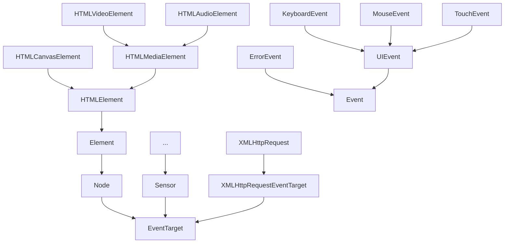
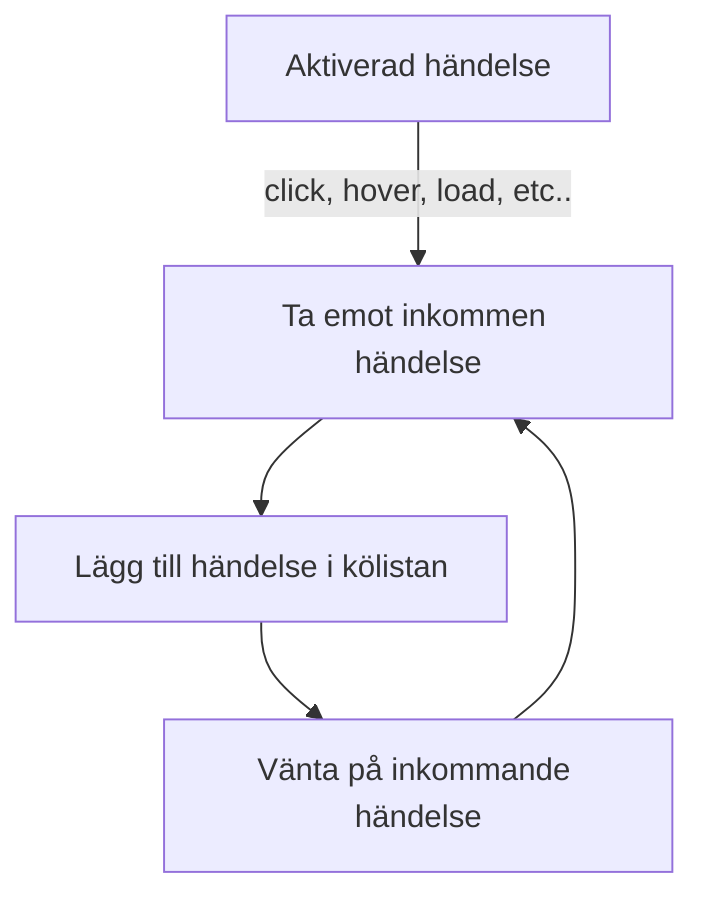
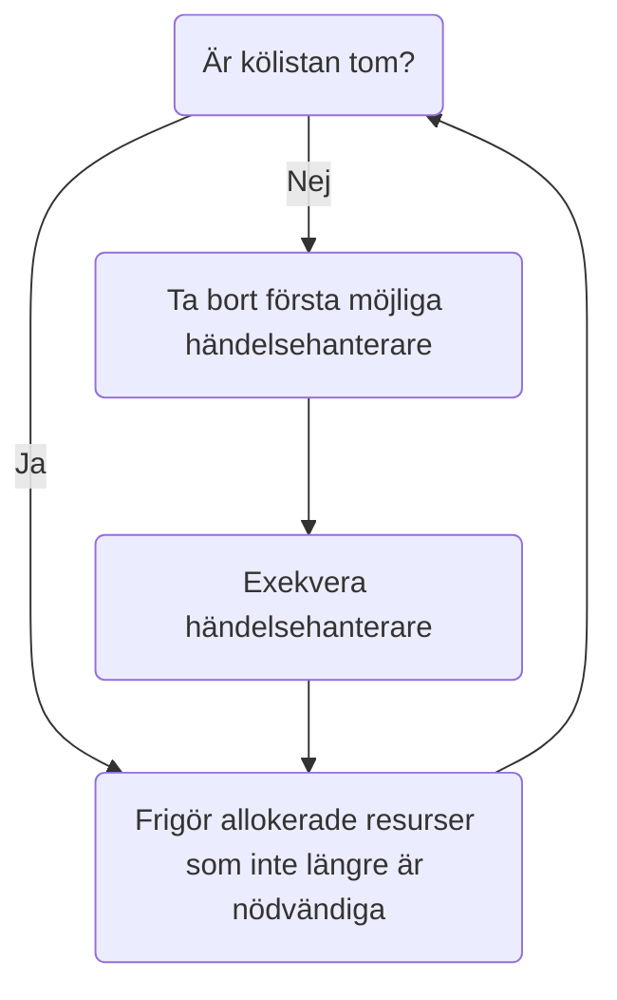
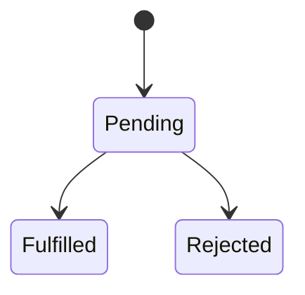
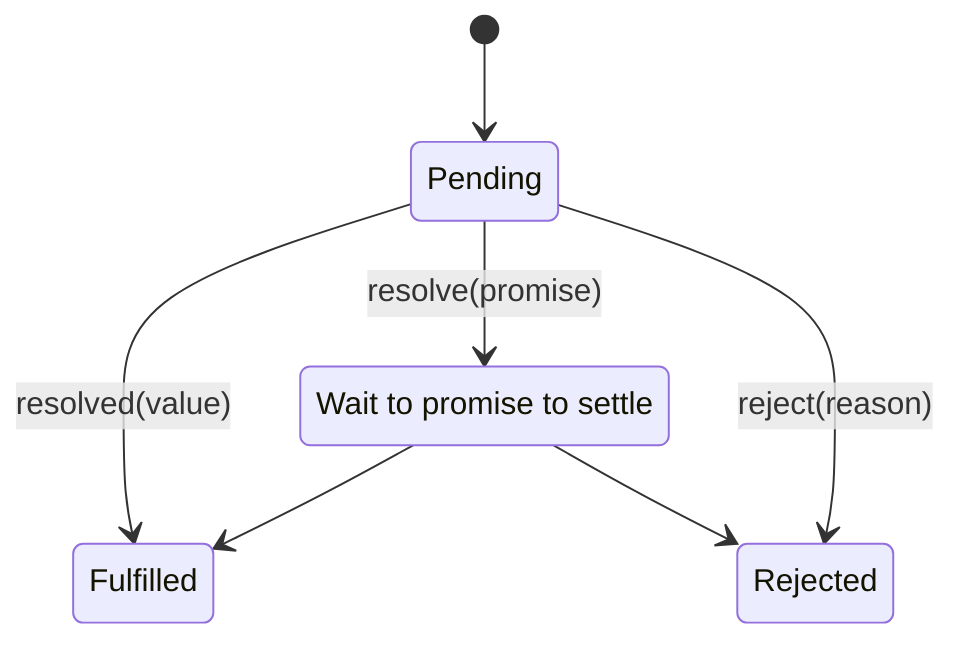

# Händelser

En introduktion till händelsehantering med JavaScript

---

## Introduktion

- Enligt Mozilla (2020) är ett `Event` en åtgärd eller händelse som sker inom det system som programmeras; *systemet uppmärksammar händelser genom att förmedla en singal om att en specifik händelse har inträffat, samt tillhandahålla mekanism för automatisk exekvering av åtgärd, till följd av aktuell händelse.*
- Det förekommer flera typer av händelser; *följande exempel tillhandahålls av Mozilla (2020):*
  - När användaren väljer ett visst element, eller för muspekaren över det valda elementet
  - När användaren trycker ned en tanget på tangentbordet
  - När användaren ändrar storlek, eller stänger aktuellt webbläsarfönster
  - När en webbsida laddads ned och görs tillgänglig via webbläsaren
  - När ett webbformulär skickas
  - När en video spelas upp, pausas eller avslutas
  - När ett fel uppstår
- Mozilla (2021) listar ett fleratal händelsetyper i sitt händelseregister; *men notera att registret inte enbart innehåller standardiserade händelsetyper - det förekommer även webbläsarspecifika.*

---

## Händelser

- Händelser är inte standardiserade av ECMA, och är således inte en del av ECMAScript; händelser består av programmeringsbara gränssnitt (API) som implementeras av webbläsartillverkare och standardiseras av W3C och/eller WHATWG (Web Hypertext Application Technology Working Group).
- Då händelser är en förutsättning för att skapa människa-datorinteraktion, är det viktigt att förstå händelsemodellerna som ger utvecklare denna möjlighet.
- Händelser förekommer under två standardformer:
  - DOM Level 0 Event Model
  - DOM Level 2 Event Model

---

### DOM Level 0 Event Model

- Händelsemodell som saknar standardisering och introducerades 1995 av Netscape i samband med lanseringen av Navigator 2; *ironiskt nog är den händelsemodell som saknar standard, den som har mest enhetligt stöd hos webbläsartillverkare.*
- Mozilla (2020) avråder från användning av denna händelsemodell; *den finns kvar på grund av "arvstöd" (legacy support).*

```html
<button onclick="alert('Hello World')">Press me</button>
```

*Fig. Inom DOM Level 0 Event Model registreras händelselyssnare via HTML-attribut som representerar aktuell händelsetyp. Ett händelselyssnarattribut kan innehålla direkt programkod, eller referens till funktionsobjekt.*

---

#### För- och nackdelar

- Fördelar:
  - Fungerar enhetligt bland webbläsare.
- Nackdelar:
  - Resulterar i att JavaScript-logik vävs samman med HTML.
  - Begränsar antalet händelsehanterare till en per händelsetyp.

---

### DOM Level 2 Event Model

- Enligt W3C (2020) har DOM Level 2 Event Model utformats efter två distinkta målsättningar: 
  - **Generellt händelsesystem**; *möjlighet att registrera händelselyssnare, följa händelseförlopp via trädstruktur och beskriva kontextuell information angående inträffad händelse.*
  - **Bakåtkompabilitet**; *att samtidigt erbjuda en underliggande händelsemodell (new registration model), som följer den som introducerades i samband med DOM Level 0 Event Model.*

```javascript
var btn = document.getElementById("btn-save");
btn.addEventListener("click", save);
function save(event) {
  // ...
}
```

*Fig. Exempel på händelselyssnare med DOM Level 2 Event Model.*

---

#### För- och nackdelar

- Fördelar
  - Här helt separerade från eventuell HTML-struktur.
  - Kan applicera flera händelselyssnare av samma typ, till samma objekt.
  - Erbjuder information om aktuell händelse via standardiserat `Event`-objekt.
  - *(Erbjuder stöd att använda DOM Level 0 Event Model-likande logik, direkt via JavaScript, med egenskapsrepresentationer för möjliga händelsetyper)*
- Nackdelar:
  - Har historiskt sett saknat en enhetlig implementation bland webbläsare; *Microsoft Internet Explorer-serien av webbläsare valde en egen implementation av standarden, något som försvårade webbutveckling fram till och med IE9.*

---

## DOM Level 2 Event Model



*Fig. DOM Level 2 Event Model har sitt ursprung ur `EventTarget`. Denna figur illustrerar några av dom klasser som baserar sin funktionalitet på händelsesystemet. Urvalet av klasser är baserat på innehåll som inkluderas i kursen.*

---

### Terminologi

- Det förekommer ett antal begrepp och termer inom DOM Level 2 Event Model; *här följer en lista över dom mest grundläggande:*
  - Händelselyssnare (listeners)
  - Händelsehanterare (handlers)
  - Händelsemål (event targets)
  - Händelseobjekt (event)
  - Bubbla och fånga händelser (bubbling & capture)

---

#### Händelselyssnare

- En händelselyssnare består av funktionalitet som kontrollerar huruvida en specifik händelse har inträffat, och ansvar att förmedla information om aktuell händelse till sin händelsehanterare (Mozilla, 2020).
- Händelselyssnare möjliggörs via gränssnittet `EventListener` (W3C, 2020)

```web-idl
// Introduced in DOM Level 2:
interface EventListener {
  void	handleEvent(in Event evt);
};
```

*Fig. W3Cs (2020) IDL-definition av `EventListener`. Metoden `handleEvent` representerar registrerad händelsehanterare.*

---

#### Händelsehanterare

- En händelsehanterare representeras av den programkod som exekveras till följd av att en specifik händelse uppmärksammades av registrerad händelselyssnare (Mozilla, 2020); *hänselsehanterar beskrivs ibland med termen `callback`.*
- Är vanligtvis representerad av en funktion (`Function`) som exekveras i samband med inträffad händelse; *denna funktion förväntas ta emot en parameter av datatypen `Event`.*
- Inom kontexten av en händelsehanterare refererar nyckelordet `this` till den `EventTarget` som registrerade händelselyssnaren.

---

#### Händelsemål

- Ett objekt med möjlighet att registrera händelselyssnare; *representeras vanligtvis av ett `DOMElement`, men appliceras även på objekt som inte är förknippade med Document Object Model (DOM).*
- *Ett objekt måste implementera eller ärva från detta gränssnitt, om det skall ha förmåga att hantera händelser.*

```web-idl
// Introduced in DOM Level 2:
interface EventTarget {
  void      addEventListener(in DOMString type, 
                in EventListener listener, 
                in boolean useCapture);
  void      removeEventListener(in DOMString type, 
                in EventListener listener, 
                in boolean useCapture);
  boolean   dispatchEvent(in Event evt)
                raises(EventException);
};
```

*Fig. W3Cs (2020) IDL-definition av `EventTarget`-gränssnittet. Detta är detta gränssnitt som medför funktinalitet för att registrera och avregistrera händelselyssnare via `addEventListener` och `removeEventListener`.*

---

#### Händelseobjekt

- Händelseobjektet (`Event`) används för att tillföra kontextuell information om aktuell händelse, till den händelsehanterare som behandlar händelsen (W3C, 2020).
- Objektet förmdelas per automatik till registrerad händelsehanterare i form av parameter, och innehåller relevant information i form av publika egenskaper.

```javascript
var btn = document.getElementById("btn-save");
btn.addEventListener("click", save);
function save(event) { // Händelseobjekt
  event.target.disabled = true;
}
```

*Fig. Händelseobjektet hanteras som `event` och används för att referera tillbaka (`event.target`) till det HTML-element som aktiverade händelsehanteraren.*

---

```web-idl
// Introduced in DOM Level 2:
interface Event {
  // PhaseType
  const unsigned short CAPTURING_PHASE = 1;
  const unsigned short AT_TARGET       = 2;
  const unsigned short BUBBLING_PHASE  = 3;

  readonly attribute DOMString        type;
  readonly attribute EventTarget      target;
  readonly attribute EventTarget      currentTarget;
  readonly attribute unsigned short   eventPhase;
  readonly attribute boolean          bubbles;
  readonly attribute boolean          cancelable;
  readonly attribute DOMTimeStamp     timeStamp;
  void  stopPropagation();
  void  preventDefault();
  void  initEvent(in DOMString eventTypeArg, 
            in boolean canBubbleArg, 
            in boolean cancelableArg);
};
```

*Fig. W3Cs (2020) IDL-definition av `Event`-objektet.*

---

#### Bubbla och fånga händelser

- DOM-relaterad händelsehantering inkluderar:
  - **Bubbling**; *process där händelsehanterare aktiveras i uppåtstigande turordning, baserat på deras händelsemåls position i DOM-trädet. Processen inleds vid det element som aktiverade händelsehanteraren.*
  - **Fångst**; *process där händelsehanterare aktiveras i nedåtstigande ordningsföljd, baserat på det händelsemål som utgör roten av nestlade händelsemål.*
- Vid användning av bubbling och/eller fångst, är följande `Event`-egenskaper viktiga:
  - `Event.target`; *referens till det objekt som aktiverade händelsehanteraren.*
  - `Event.currentTarget`; *refererar till det objekt som registerade händelselyssnaren, denna referens uppdateras således inte under `bubbling`- eller `capture`-fasen.*
- Bubbling kan stoppas genom att anropa `Event.stopPropagation()`.

---

```html
<html>
  <script>
    window.onload = function() {
      var divs = document.getElementsByTagName("div");
      for (var i = 0; i < divs.length; i++) {
        divs[i].addEventListener("click", onClick);
      }
      function onClick(event) {
        //event.stopPropagation();
        console.log(event.target, event.currentTarget);
      }
    };
  </script>
  <body>
    <div id="first">
      <div id="second">
        <div id="third"></div>
      </div>
    </div> 
  </body>
</html>
```

*Fig. Exempel på `bubbling`. Egenskapen `target` hänvisar alltid till det händelsemål som aktiverade händelsen, dvs det element som användaren klickar på. Egenskapen `currentTarget` hänvisar till aktuellt element i bubblingsprocessen.*

---

```html
<html>
	<script>
    window.onload = function() {
      var elm = document.getElementById("list");
      elm.addEventListener("click", onClick);
      function onClick(event) {
        console.log(event.target);
        console.log(event.currentTarget);
      }
    };
  </script>
  <body>
    <ul id="list">
      <li>Item 1</li>
      <li>Item 2</li>
      <li>Item 3</li>
    </ul>
  </body>
</html>
```

*Fig. Exempel där `target` hänvisar till det list-element som användaren klickat på, `currentTarget` refererar alltid tillbaka till `ul`-elementet som innehåller list-elementen.*

---

#### Händelsetyper

- Det förekommer flera typer av händelser; denna lista innehåller händelsetyper som är av intresse för denna kurs, för mer information se Mozillas (2021) händelseregister:
  - Resource events
  - Network events
  - Focus events
  - Session History events
  - CSS Animation events
  - CSS Transition events
  - Form events
  - Clipboard events
  - Keyboard events
  - Mouse events
  - Drag & Drop events
  - Media events
  - Progress events
  - Window events
  - Sensor events
  - Touch events

---

### Minneshögen

- Den "plats" inom JavaScript där minne allokeras i syfte att lagra variabler och funktioner, under exekvering; *all information som skapas under exekvering, lagras i minneshögen.*

---

### Skräpsamlaren

- Allokerat minne som inte längre används, tas bort av värdmiljöns `garbage collector` (GC).
- När minne frigörs, tas objekt bort från minneshögen (memory heap).

```javascript
var obj = new MassiveObject();
obj = null; // removes reference, not object.
```

*Fig. Då `obj` är ett referensobjekt, kan dess referens sättas till `null`; denna process förstör/slänger inte instansen av `obj`. Minne kan enbart frigöras av skräpsamlaren (GC) som kommer att ta bort `obj` då den inte längre används inom kontexten av aktuell applikation (det finns inga referenser till detta objekt).*

---

### Anropsstacken

- Inom JavaScript är anropsstacken (call stack) en datastruktur som hanterar pågående exekvering.

```javascript
function a(x) {
  return x * 0.5;
}

function b(x) {
  var r = a(x);
  console.log(r); // 50
}

b(100);
```

*Fig. Ett JavaScript-exempel vars anropsstack kan illustreras relativt enkelt.*

---

- Denna punktlista representerar anropsstacken från föregående kodexempel:
  1. **Initiering**; *tolken läser in samtlig källkod och börjar sedan att exekvera anrop i turordning, metodanropet `main` representerar denna initiala process:*
     - `main()`
  2. **Exekvera b**; *den första medtod att anropas är `b`, metoden läggs till på stacken efter `main`:*
     - `b(x)`
     - `main()`
  3. **Exekvera a**; *metoden `b` anropar `a` och läggs därför till på stacken efter `b`:*
     - `a(x)`
     - `b(x)`
     - `main()`
  4. **Exekvera console.log**; *då `a` returnerar ett resultat tillbaka till `b`, tas `a` bort från stacken. Metoden `b` anropar sedan `console.log`:*
     - `console.log(str)`
     - `b(x)`
     - `main()`
  5. **Tillbaka till `b`**; *när `console.log` avslutats, tas den bort från stacken:*
     - `b(x)`
     - `main()`
  6. **Avslut**; *då `b` inte innehåller fler anrop, tas den bort från stacken. Då `main` inte innehåller fler anrop, kommer exekveringen att nå ett slut, och `main` tas bort från högen:*
     - `main()`

---

### Händelseslingan

- Samtliga händelser inom JavaScript hanteras av händelseslingan (event loop); *en ständigt pågående process som placerar inkommande händelser i en kölista, för att senare exekvera listans innehåll, steg för steg.*
- Händelseslingan lägger till anrop i anropsstacken, då de görs tillgängliga.



*Fig. Illustrerar JavaScripts pågående process med att lyssna efter händelser. När en händelse inträffar, förmedlas händelsens händelsehanterar till en kölista. Notera att händelsehanteraren inte exekveras under denna process.*

---



*Fig. Illustrerar JavaScripts händelseslinga. Notera att slingan exekverar händelsehanterare i turordning.*

---

```javascript
setTimeout(function() {
  console.log("B");
}, 0); // Notera 0 ms fördröjning

console.log("A");
```

*Fig. Programmet skriver ut `'A'` före `'B'`, detta då `'B'` är en process av händelseslingan och `'A'` exekveras direkt ur aktuell anropsstack (call stack).*

---

- Här följer en förenklad beskrivning av föregående exempels exekvering: 
  1. Initiering; *läser in källkod, detta innebär inte att `setTimeout`s `callback` exekveras.*
  2. Exekverar `console.log("A")`; *exekverar utskfrift av `'A'`.*
  3. Exekverar händelseslingan; *det huvudsakliga programmet har nått sitt slut, dags att hantera eventuella anrop i händelseslingan.*
  4. Exekverar `console.log("B")`; exekverar utskfrift av `'B'`.
  5. Avslut; *avslutar då det inte finns fler anrop i anropsstacken.*

---

## Löften

- Ett löfte (`Promise`) är en del av ECMAScript-specifikationen, och är utformat som ett objekt, som representerar ett förväntat resultat av en uppskjuten, och eventuellt asynkron beräkning (Ecma International, 2020).
- Löften är ett relativt nytt koncept som introducerades i och med ECMAScript 6.
- Löften används vanligtvis för att representera ett resultat av en asynkron åtgärd; *exempelvis inladdning av fil från aktuellt filsystem eller webbresurs via URL.*

---

### Tillstånd

- Enligt Mozilla (2019) kan ett löfte kan befinna sig i ett av tre möjliga tillstånd:
  - **pending**; *ursprungligt tillstånd - har varken genomförts eller nekats.*
  - **fulfilled**; *beräkningen har genomförts med ett lyckat resultat.*
  - **rejected**; *beräkningen har genomförts med ett misslyckat resultat.*
- Ett löfte som lämnar sitt ursprungliga tillstånd (pending), kan aldrig byta till ett nytt tillstånd; *om samma beräkning skall genomföras med annat utfall, måste ett nytt löfte skapas.*



*Fig. Ett löftes (promise) olika tillstånd.*

---

### Gränssnitt

- `promise.constructor(resolver:Function):Promise`; *global konstruktorfunktion som används tillsammans med `new`-operatorn för att skapa en ett nytt `Promise`-objekt.*
- `promise.then([onFulfilled:Function], [onRejected:Function]):Promise`; *aktiverar löftet och exekverar en av parametrarna så snart svarsdata finns tillgängligt. Valet av exekverad parameter beror på huruvida löftet lyckades eller inte.*
- `promise.catch(onRejected:Function):Promise`; *sätter aktuellt `Promise`-objekt till `rejected` och aktiverar objektets `reject`-process.*
- `promise.finally(onFinally:Function):Promise`; *tillhandahåller en parameter som anropas då `Promise`-objektet har nått ett slutgiltigt tillstånd. Användbar då flera objekt sammankopplas.*

---

### Exekutor

- En exekutor (även kallad `resolver`) är ett löftes motsvarighet till `callback`-funktion/händelsehanterare.
- Förmedlas som parameter till `Promise`-objektets konstruktormetod
- En executor skall vara en `Function` utan returvärde, och med parametrarna:
  - **resolve**; *referens till `Funktion` som anropas då aktuell beräkning är färdigställd och lyckad.*
  - **reject**; *referens till `Function` som anropas då eventuella fel uppstår.*

---

```javascript
function loadImageURL(URL) {
  var promise = new Promise(function(resolve, reject) {
    var img = new Image();
    img.src = URL;
    img.onload = function(event) {
      resolve(img);
    }
    img.onerror = function(event) {
      reject(event);
    }
  });
  return promise;
}

var p = loadImageURL("https://...");
p.then(function(img) {
  document.body.appendChild(img);
});
```

*Fig. Exempelkod som använder ett `Promise` för att ladda ett bild-element.*

---

### Kedjade löften

- Metoderna `then()`, `catch()` och `finally` hos ett `Promise`-objekt kan användas för att associera vidare åtgärder i samband med att aktuellt löfte genomförts med lyckat utfall (Mozilla, 2019).
- Ovanstående punkt innebär att flera `Promise`-objekt kan sammankopplas i en samverkande kejda.



*Fig. Illustrerar hur ett `Promise`-objekt kan avvisa eller fullfölja ett annat löfte.*

---

## Sammanfattning

- Händelser kategoriseras inom DOM Level 0 Event och DOM Level 2 Event; *använd inte DOM Level 0 Event.*
- DOM Level 2 Event ligger till grund för samtliga interaktiva DOM-element.
- DOM Level 2 Event kan delas upp i följande byggstenar:
  - Händelselyssnare
  - Händelsehanterare
  - Händelsemål
  - Händelseobjekt
  - Händelsetyper
- Händelser kan..
  - Bubbla (i DOM-tädet)
  - Fånga (i DOM-trädet)
- Löften introducerades i ES6 och erbjuder ett "nytt" sätt att skapa platshållarvärden för asynkron data.

---

## Referenser

Ecma International (2020). ECMAScript® 2021 Language Specification. [online] Available at: https://tc39.es/ecma262/

Mozilla. (2021). *Event reference | MDN*. [online] Available at: https://developer.mozilla.org/en-US/docs/Web/Events

Mozilla. (2020). *Introduction to events*. [online] Available at: https://developer.mozilla.org/en-US/docs/Learn/JavaScript/Building_blocks/Events

Mozilla. (2019). *Promise*. [online] Available at: https://developer.mozilla.org/en-US/docs/Web/JavaScript/Reference/Global_Objects/Promise

W3C (World Wide Web Consortium) (2020). *Document Object Model (DOM) Level 2 Events Specification*. [online] Available at: https://www.w3.org/TR/DOM-Level-2-Events/