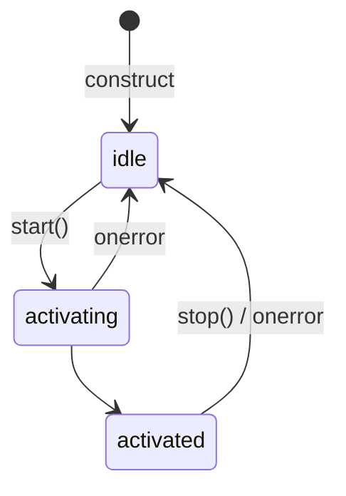
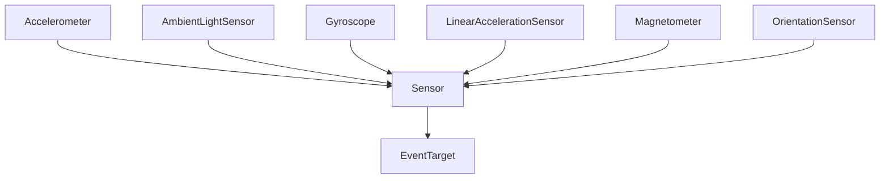

# Sensorer

In introduktion till utveckling med webbstandardiserad sensordata

---

## Introduktion

- Det förekommer ett flertal webbstandarder för hantering av sensordata
- Denna föreläsning är baserad på standarder och specifikationer, inte dokumentation från diverse webbläsartillverkare
  - Notera att en implementation kan avvika från en specifikation

---

## Generic Sensor API

- Ett programmeringsbart grässnitt som syftar att standardisera användning av sensordata inom kontexten av webbaserade produkter och tjänster, skrivna i JavaScript (W3C, 2019)
- Enligt W3C (2019d) är gränssnittet enbart riktat mot interna enhetssensorer, och inte externa sensorer som exempelvis kan parkopplas via blåtand (Bluetooth)
- I praktiken en uppsättning abstrakta klasser (primärt klassen `Sensor`) som används som grund för följande sensorbaserade APIer:
    - Accelerometer (LinearAccelerationSensor, GravitySensor)
    - AmbientLightSensor
    - Gyroscope
    - Magnetometer
    - OrientationSensor

---

### Tillstånd



*Fig. Representerar ett `Sensor`-objekts möjliga tillstånd.*

---

### Gränssnitt

```web-idl
[SecureContext, Exposed=(DedicatedWorker, Window)]
interface Sensor : EventTarget {
  readonly attribute boolean activated;
  readonly attribute boolean hasReading;
  readonly attribute DOMHighResTimeStamp? timestamp;
  void start();
  void stop();
  attribute EventHandler onreading;
  attribute EventHandler onactivate;
  attribute EventHandler onerror;
};

dictionary SensorOptions {
  double frequency;
};
```

*Fig. W3Cs (2019d) standardiserade gränssnitsbeskrivning av Generic Sensor API.*

---

- Lärdomar utifrån ovannämnd gränssnittsbeskrivning:
	- Avläsning av sensordata kan startas och stoppas via dedikerade metoder
	- Händelselyssnare kan appliceras då `Sensor` ärver från `EventTarget`
- Detta är intressanta observationer då detta gäller för samtliga sensor-APIer som ärver från den abstrakta klassen `Sensor`

---

### Struktur



*Fig. Illustrerar arvsstrukturen för standardiserade sensor-APIer.*

---

## Accelerometer

- Representerar en accelerometer-sensor (W3C, 2019a)
- Sensordata presenteras som aktuell acceleration i x-, y- och z-axel; *hastighet beskrivs i meter per sekundtvå (m/s²)*
	- Ett numerisk värde som beskriver enhetens hastighetsdelta per sekund
- Klassen `Accelerometer` är superklass till..
  - ` LinearAccelerationSensor`; *representerar kraft orsakad av rörelse, men inte gravitation*
  - `GravitySensor`; *representerar enbart kraft orsakad av gravitation*

---

### Användningsfall

- Sensordata kan exempelvis användas för att..
  - Aktivera eller avaktivera funktionalitet beroende på aktuell enhets orientering
  - Anpassa en applikations innehåll och/eller layout beroende på aktuell enhets orientering
  - Omvandlas till instruktioner till exempelvis spelkarraktär

---

### Exempel

```javascript
var sensor = new Accelerometer();

sensor.onreading = function(event) {
  console.log("Acceleration along X-axis: " + sensor.x);
  console.log("Acceleration along Y-axis: " + sensor.y);
  console.log("Acceleration along Z-axis: " + sensor.z);
}

sensor.onerror = function(event) {
  console.log(event.error.name, event.error.message);
}

sensor.start();
```

*Fig. Applikation som läser av och presenterar aktuell enhets acceleration kring axlarna x, y och z. Felmeddelanden skrivs ut vid eventuella fel.*

---

## AmbientLightSensor

- Representerar en sensor för omgivande ljus (W3C, 2019b)
- Ljusnivå anges i lux (lumen/m²)
  - 0.0001; *mulen natthimmel*
  - 100000; *direkt solljus*

---

### Användningsfall

- Sensordata kan exempelvis användas för att..
  - Beräkna inställningar för en kameraapplikation (bländare, slutar och ISO)
  - Kontrollera huruvida aktuell ljusnivå är lämplig arbetsbelysning
  - Förmedla information om aktuell ljusnivå till andra mjukvarusystem, som exempelvis för hemautomation

---

### Exempel

```javascript
var sensor = new AmbientLightSensor();

sensor.onreading = function(event) {
  console.log(sensor.illuminance);
}

sensor.onerror = function(event) {
  console.log(event.error.name, event.error.message);
}

sensor.start();
```

*Fig. Applikation som läser av och presenterar aktuell ljusnivå. Felmeddelanden skrivs ut vid eventuella fel.*

---

## Gyroscope

- Representerar ett gyroskop med axlarna x, y och z (W3C, 2019e)
- Sensordata anges i radianer per sekund (rad/s)

---

### Användningsfall

- Sensordata kan exempelvis användas för att..
  - Simulera ett vattenpass

---

### Exempel

```javascript
var sensor = new Gyroscope({
  referenceFrame: "screen",
  frequency: 60
});

sensor.onreading = function() {
  console.log("x:" + sensor.x);
  console.log("y:" + sensor.y);
  console.log("z:" + sensor.z);
}

sensor.onerror = function(event) {
  console.log(event.error.name, event.error.message);
}

sensor.start();
```

*Fig. Applikation som läser av aktuell enhets gyroskop-sensor. Felmeddelanden skrivs ut vid eventuella fel. Notera hur orienteringsreferens samt uppdateringsfrekvens förmedlas i samband med instansiering.*

---

## Magnetometer

- Representerar en sensor med förmåga att läsa av magnetfält runt axlarna x, y och z (W3C, 2019c)
- Sensordata anges i μT (mikrotesla)

---

### Användningsfall

- Sensordata kan exempelvis användas för att..
  - Konstatera närvaro, och således användning av metall, exempelvis i objekt
  - Simulera en analog kompass

---

### Exempel

```javascript
var sensor = new Magnetometer();

sensor.onreading = function() {
  console.log("x:" + sensor.x);
  console.log("y:" + sensor.y);
  console.log("z:" + sensor.z);
}

sensor.onerror = function(event) {
  console.log(event.error.name, event.error.message);
}

sensor.start();
```

*Fig. Applikation som läser av och skriver ut magnetfält kring x-, y- och z-axel. Felmeddelanden skrivs ut vid eventuella fel.*

---

## OrientationSensor

- Representerar en sensor med förmåga att beskriva aktuell enhets orientering (W3C, 2019f)
- Sensordata presenteras i form av rotationsmatris, representerad av en `Array`
  - Referensen till `Array`-objektet hänvisar inte till realtidsdata, det är en representation av sensordata från senaste tidstämpel

---

### Användningsfall

- Sensordata kan exempelvis användas för att..
  - representera rotation i tredimensionell virtuell miljö

---

### Exempel

```javascript
var sensor = new AbsoluteOrientationSensor();
var mat4 = new Float32Array(16);

sensor.onreading = function(event) {
  sensor.populateMatrix(mat4);
};

sensor.onerror = function(event) {
  console.log(event.error.name, event.error.message);
}

sensor.start();
```

*Fig. Applikation som läser av aktuell enhets orientering och beskriver datan i form av matris, representerad av ett `Array`-objekt.*

---

## Referenser

World Wide Web Consortium (W3C). (2019a). *Accelerometer*. [online] Available at: https://www.w3.org/TR/accelerometer/.

World Wide Web Consortium (W3C). (2019b). *Ambient Light Sensor*. [online] Available at: https://www.w3.org/TR/ambient-light/

World Wide Web Consortium (W3C). (2019c). *Magnetometer*. [online] Available at: https://www.w3.org/TR/magnetometer/.

World Wide Web Consortium (W3C). (2019d). *Generic Sensor API*. [online] Available at: https://www.w3.org/TR/generic-sensor/.

World Wide Web Consortium (W3C). (2019e). *Gyroscope*. [online] Available at: https://www.w3.org/TR/gyroscope/.

World Wide Web Consortium (W3C). (2019f). *Orientation Sensor*. [online] Available at: https://www.w3.org/TR/orientation-sensor/.