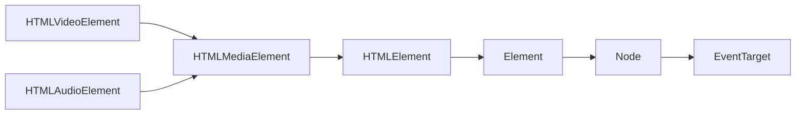
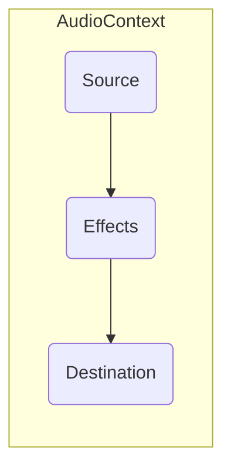

# Multimedia

En introduktion till hantering av ljud och video på webben och/eller med webbteknik.

---

## Introduktion

- Begränsad Internetuppkoppling var länge en orsak som minskade intresset för ljud och video på webben.
- I takt med förbättrad Internetuppkoppling och ökad lagringsförmåga, kan ljud och video inkluderas i webb- och skrivbordsapplikationer:
	- **PWA**; *kan i förväg ladda ned och lagra ljud och video i applikationens cache-minne.*
	- **Electron**; *ljud och video kan "bakas in" i den färdigställda binärfilen som representerar applikationen.*

---

## Historia

- Webben var ursprungligen utformad för text; *Inbäddade bilder (``) blev standard först i HTML 2.0*, detta då det gjorts populärt bland webbläsartillverkare.
- För att kompensera för saknad funktionalitet hos webbläsare, användes insticksmoduler:
- RealPlayer
	- Adobe Flash (Player)
	- Microsoft Silverlight

---

### Insticksmoduler

- En mjukvarukomponent som tillför ny funktionalitet till en befintlig mjukvara.
- En insticksmodul begränsas av sin värdmiljö; *en insticksmodul kan verka inom en, av värdmiljön definerad, `sandbox`.* 
- Är ofta "specialversioner" av annan mjukvara.

---

#### RealPlayer

- Mediaspelare som introducerades 1995, och gjordes tillgänglig i webbläsare som insticksmodul (RealNetwork, 2016).
- Introducerades med funktionalitet för att strömma media över Internet; *användare var inte längre tvungna att ladda ned hela filmklipp, innan innehållet gick att tyda.*

---

#### Adobe Flash

- Ekosystem för att skapa interaktiva multimediala användarupplevelser, primärt för webben via insticksmodul.
- Plattformen introducerades 1993 och var bland annat den teknologi som gav upphov till Youtube.
- Introducerade skriptspråket ActionScript som i senare utgåva komm att baseras på den övergivna ECMAScript 4-specifikationen; *objektorienterat skriptspråk med förmåga att skapa interaktiva multiplattformsapplikationer för mobila och stationära enheter.*
- Jobs (2010) attakerade plattformen i ett öppet brev; *detta brev, i kombination med Jobs vägran att tillåta Adobe Flash under iOS, blev början för slutet av Adobe Flash på webben.*
- Adobe Flash Player nådde EOL i december 2020, men andra delar av plattformen kvarstår (dock inte under Adobes ledning) (Adobe, 2020).

---

#### Microsoft Silverlight

- Introducerades 2007 och var Microsofts motsvarighet till Adobe Flash Player, och dåvarande Adobe Flex.
- Användes exempelvis av företag som Netflix och CDON för att strömma video direkt till kunders webbläsare.

---

#### Fördelar

- Fördelar med insticksmoduler är bl.a.:
	- Utökar värdmiljöns funktionalitet.
	- Innebär vanligtvis en enhetlig utvecklingsmiljö, oberoende av värdplattform.

---

#### Nackdelar

- Nackdelar med insticksmoduler är bl.a.:
	- Måste installeras och aktivt "underhållas" av användaren (finns undantag).
	- Exekveras i en egen, delvis isolerad kontext (sandlåda)
		- JavaScript kan exempelvis inte direkt kommunicera med insticksmodulen; *måste förekomma någon slags kommunikationsbrygga*
	- Ofta resurskrävande.
	- Kan vara en potentiell säkerhetsrisk.

---

## HTMLMediaElement

- Introducerades i och med HTML 5-specifikationen, och var menad att avveckla behovet av multimedia-insticksmoduler, i moderna webbläsare.
- WHATWG (2021) menar att insticksmoduler kan användas i kombination med `HTMLMediaElement`, dock enbart för att ge stöd åt äldre webbläsare som inte har stöd för HTML 5.
- Representerar ett abstrakt gränssnitt för uppspelning, och hantering av ljud- och videomaterial; *direkt i aktuell webbläsare eller värdmiljön*.
- Har ett programmeringsbart gränssnitt, samt en DOM-representation.
- Är superklass för `HTMLAudioElement` och `HTMLVideoElement`; mer om detta senare.



*Fig. Illustrerar arvsstrukturen för mediaelement inom HTML5-standarden. Notera att `HTMLVideoElement` och `HTMLAudioElement` utgår från EventTarget, villket innebär att elementen i någon form, kan hanteras via JavaScript-kod.*

---

### Fördelar

- Då `HTMLMediaElement` ärver från `EventTarget` kan JavaScripts händelsesystem användas för att hantera uppspelning.
- Då `HTMLMediaElement` är ett`HTMLElement`, är det att betrakta som ett "vanligt" HTML-element.
- Har ett standardgränssnitt (GUI) som kan ersättas med egenutvecklat; *använd DOM-strukturen för att utforma gränssnittselement som kan användas för att hantera uppspelning.*

---

## HTMLAudioElement

- Representerar ett HTML-element med förmåga att spela upp, och kontrollera uppspelning av ljudfiler; *aktivera användarkontroller genom att inkludera attributet `controls`.*
- Deklareras via HTML som `<audio>`.
- Klassen implementerar inga egna egenskaper eller metoder; *är identisk med `HTMLMediaElement. `*
- Standarden stödjer tre ljudformat, det finns dock inga garantier att samtliga format stöds av flertalet webbläsare:
	- **MP3**; *audio/mpeg*
	- **OGG**; *audio/ogg*
	- **WAV**; *audio/wav*

---

### Exempel

```html
<audio controls>
  <source src="1me333_lecture.mp3" type="audio/mpeg">
  <source src="1me333_lecture.ogg" type="audio/ogg">
  <p>Your browser doesn't support HTML5 audio. Here is
     a <a href="1me333_lecture.mp4">link to the audio</a> instead.</p>
</audio>
```

*Fig. Exempel som skapar ett `HTMLAudioElement` med två möjliga ljudformat.* 

---

## HTMLVideoElement

- Representerar ett HTML-element med förmåga att spela upp, och kontrollera uppspelning av videofiler.

---

### Exempel

```html
<video controls width="250">
    <source src="1me333_lecture.webm" type="video/webm">
    <source src="1me333_lecture.mp4"  type="video/mp4">
    <p>Sorry, your browser doesn't support embedded videos.</p>
</video>
```

*Fig. Exempel som skapar ett `HTMLVideoElement` med två möjliga videoformat.*

---

## Web Audio API

- Då HTML 5s `HTMLAudioElement` är relativt begränsat, erbjuds `Web Audio API` som ett mer kraftfullt alternativ; *baseras på ett modulärt system där ljudsingaler dirigeras genom ett sammankopplat nätverk av noder, där varje nod har förmåga att modifiera den inkommande signalen.*
- Denna föreläsning ger enbart en förenklad introduktion, för mer information se fullständig specifikation.



*Fig. En `AudioContext` består av eventuella källor (audio-element, strömmad media, mm.), effekter (efterklang, ljudfiler, mm.) och en bestämd slutdestination (exempelvis enhetens högtalare).*

---

#### Ljudkälla

- En W3C (2020) kan en ljudkälla (`Source`) kan bestå av flera saker:
  - `AudioNode`; *ljud som genereras dynamiskt via JavaScript, exempelvis via `OscillatorNode`.*
  - PCM[^1]; *ljud kan återskapas från PCM-data som representeras av en `AudioBuffer`.*
  - `HTMLMediaElement`; *DOM-element med förmåga att spela upp ljud, kan användas som ljudkälla. Elementen kan hämtas direkt från befintlig DOM-struktur eller genereras via `document.createElement`.*
  - `MediaStream`; *ljud kan hämtas från en pågående mediaström.*

[^1]: Pulse-code modulation (PCM) - Standardmetod för att representera analoga singnaler inom en digital kontext.

---

```javascript
var audioElm = document.getElementById("audioElm");

var context = new AudioContext();
var source = context.createMediaElementSource(audioElm);
var effect = context.createDelay(2);

source.connect(effect);
reverb.connect(context.destination);
```

*Fig. Skapar en ny `AudioContext` som använder ett `HTMLAudioElement` som sin ljudkälla (`source`). En `DelayNode` används för att för att ge ljudkällan efterklang under uppspelning. Notera hur `source` kopplas till `effect`, som i sin tur kopplas till `context`. Enhetens högtalare representeras av `context.destination`.*

---

## Animation

- Animation på webben var länge associerat med:
  - **Graphics Interchange Format (GIF)**; *rasterbaserat animationsformat med ett maximalt färgdjup på 8 bitar.* 
  - **Adobe Flash Player (SWF)**; *vektorbaserat animationsformat som spelas upp via insticksmodulen Adobe Flash Player.*
- Med aktuella webbläsare kan animation skapas och användas på flera olika sätt:
  - **Film**; *animation som representerar en traditionell animerad film, kan exempelvis spelas upp via `HTMLVideoElement`.*
  - **Effekter**; *animerade effekter vars syfte är att vara estetiskt tillfredställande, kan exempelvis skapas i form av dynamiska och interaktiva animationer via `Canvas`.*
  - **Gränssnitt**; *animation som appliceras på gränssnittskomponenter i syfte att vara estetiskt tillfredställande och/eller informativ.*
- För att bättre förstå animation, ges en introduktion till teoretiska animationsprinciper.

---

### Animationsprinciper

- Är kända som "dom tolv animationsprinciperna".
- Utvecklades av Walt Disneys medarbetare under 1930-talet och påstås vara källan till lyckad animation
- Principerna är utvecklade för produktion av animerad kort-, och långfilm, men kan appliceras på all sorts animation.
- Föreläsningen försöker ge exempel som återkopplar till applikations- och gränssnittsutveckling

---

#### Squash and Stretch

- Innebär förändring i form, men inte volym.
- Visualiserar tyngd, främst i organiska objekt.

---

#### Anticipation

- Innebär att en animation byggs upp av en förberedande händelse, innan den huvudsakliga rörelsen. 
- Principen utgår från teorin att en rörelse som går att förutse, görs enklare att tolka; *speciellt användbart vid låga bilduppdateringsfrekvenser.*

---

#### Staging

- Princip som betonar vikten av kamerakomposition; *se till att det som är relevant hamnar i fokus hos publiken.*
- Undvik att placera händelser med för stort avstånd från varandra; *låt det finnas ett "händelsernas centrum".*

---

#### Straight Ahead and Pose to Pose

- Innefattar två tillvägagångssätt för att skapa animation:
	- **Straight ahead**; *animation konstrueras i ett kontinueligt flöde. Process som vanligtvis brukar tekniken `onion skinning` mellan två nyckelbildrutor, men kan även användas självständigt.*
	- **Pose to pose**; *animation delas upp i nyckelbildrutor som tilsammans ger en grov, men övergripande bild av animationen. Användbart verktyg för att kontrollera en animations uppspelningshastighet (timing).*

---

#### Follow-through and Overlapping Action

- **Follow-through**; *En animation består av ett flertal "löst hängande delar" som alla måste följa fysikens lagar, och är en biefekt av en huvudsaklig rörelse.*
- **Overlapping action**; *rörelser skall överlappa varandra, dvs. en rörelse skall aldrig hinna avslutas innan en ny påbörjas. Det är viktigt att påpeka att tekniken används för att undvika att en animation blir onaturligt still, överlappning skall därmed användas för att "runda av" pågående animation.*

---

#### Slow-In and Slow-Out

- Rörelse är sällan linjär; *hastighet är vanligtvis som störst i mitten av ett händelseförlopp.*
- Principen är även känd som `ease in` och `ease out`, exempelvis inom CSS-animation.

---

#### Arc

- Rörelsemönster skall följa mjuka, bågformade linjer; *raka rörelsemönster tenderar att ge ett mekanisk och livlöst intryck.*

---

#### Secondary Action

- Ett sätt att medföra konsekvenser av en huvudsaklig rörelse eller händelse, detta i syfte att förtydliga rörelsen och/eller händelsen; *en händelse aktiverar en, eller flera andra mindre händelser.*
- Det är viktigt att inte överdriva sekundära händelser, detta då de riskerar att bli primära.
- Principen bidrar till att rörelser upplevs som mer naturliga.

---

#### Timing

- Dynamisk allokering av antal bildrutor, baserat på händelsens natur; *snabba händelser eller rörelser brukar färre bildrutor än långsamma.*
- Misslyckad timing anses ofta att vara den vanligaste orsaken till att en animation uppfattas som bristfällig.
- Gäller att hitta lämplig tid för:
  - Förberedelse (Anticipation)
  - Genomförande
  - Konsekvenser (Follow-through & overlapping action)

---

#### Exaggeration

- Överdriv animation i syfte att göra den mer tydlig för publiken; *subtil animation görs svår att tyda och publiken riskerar att tappa intresset.*

---

#### Solid drawing

- Vanligtvis syftar denna princip till förmågan att rendera en tredimensionell karraktär, inom begränsningen av två dimensioner.
- Detta görs genom att applicera:
  - **Tygnd**; ett objekts massa påverkar objektet rörelse och förflyttning.
  - **Djup**; *vinklar och rotation kan användas för att göra ett objekt mer intressant och realistiskt - verkliga objekt uppfattas sällan som "flata".*
  - **Balans**; ett objekts rörelse återspeglas av dess form och tygnd.   

---

#### Appeal

- Innehåll skall vara enkelt att tyda; *utseende skall återspegla syfte och/eller avsikter.*
- Inom mjukvaruutveckling kan detta innebära att animerade gränssnittskomponenter använder utformning och animation för att ge återkoppling till användaren under en pågående process.

---

### CSS-animation

- Enligt Mozilla (2019) kan CSS-animation användas för att animera övergångar mellan CSS-konfigurationer; en CSS-animation består av:
  - **Stilsättning**; *applicera egenskapen `animation` (eller dess underegenskaper) på det element som skall animeras. Denna process möjliggör kontroll av uppspelningshastighet, fördröjning, mm..*
  - **Nyckelbildrutor**; *deklareras med at-tecken (@) och beskriver en specifik tidpunkt inom aktuell animation (även kallat nyckelbildruta). En animation består av två, eller fler nyckelbildrutor.*

---

#### Stilsättning

- Här följer tillgängliga CSS-egenskaper som kan användas för att deklarera en animation, notera att samtliga inställningar kan sättas direkt via egenskapen `animation`:
  - `animation-name`; *beskriver namnet på den `@keyframe` som deklareras animationens nyckelbildrutor.*
  - `animation-duration`; *tiden det tar för animationen att slutföras.*
  - `animation-timing-function`; *används för att kontrollera uppspelningshastighet via beskrivningskurva. Användbart för att skapa animation som applicerar `ease-in` och `ease-out` principen.*
  - `animation-delay`; *beskriver eventuell fördröjningstid innan en animation skall påbörja sin uppspelning.*
  - `animation-iteration-count`; *beskriver hur många gånger en animation skall upprepas, `infinite` kan användas för att skapa oändlig repetion.*
  - `animation-direction`; *huruvida en animation skall byta riktning då den når sitt slut. Användbart för att skapa oändliga animationer.*
  - `animation-fill-mode`; *dikterar när i händelseförloppet som animation skall applicera önskade stilsättningar.*
  - `animation-play-state`; *används för att pausa och återuppta uppspelning av en animation.*

---

#### Nyckelbildrutor

- Nykelbildrutor deklareras med `@keyframes` och ges ett specifikt namn som fungerar som unik identifierare, för aktuell uppsättning av nyckelbildrutor.
- En specifik nyckelbildruta deklareras med en procentsats som representerar dess tid tid/plats i aktuellt händelseförlopp.
- Då en animation förutsätter en start- och slutpunkt, har genvägar för 0 % och 100 % skapats: 
  - `from`; *representerar den första nyckelbildrutan, dvs 0 %.*
  - `to`; *representerar den sista nyckelbildrutan, dvs 100 %.*

---

```css
.notice {
  animation-duration: 2s;
  animation-name: slidein;
}
@keyframes slidein {
  from {
    margin-left: 100%;
    width: 300%;
  }
  to {
    margin-left: 0%;
    width: 100%;
  }
}
```

*Fig. Exempel på CSS-animation.*

---

#### Fördelar

- Mozilla (2019) listar följande fördelar med CSS-baserad animation gentemot skriptbaserad animation:
  - **Enkla att skapa och använda**; *kan skapas helt utan JavaScript-kunskap och görs således tillgängliga för personer som inte nödvändigtvis är utvecklare.*
  - **Bra presstanda**; *animation presterar bra, även under måttlig arbetsbelastning. CSS-animation använder tekniker som `frame-skipping` i syfte att förbättra användarupplevelsen, något som inte görs per automatik då JavaScript-baserade lösningar används.*
  - **Webbläsaren har full kontroll**; *webbläsaren ansvarar för uppspelning av animation (inte JavaScript-motorn), och kan därför anpassa uppspelningen efter aktuella förutsättningar.*

---

## Sammanfattning

- Insticksmoduler användes för att komplettera avsaknad av funktionalitet hos dåtida webbläsare; *HTML 5-specifikationen var menad att göra insticksmoduler irellevanta.*
- Ljud och videouppspelning möjliggörs via det gemensamma gränssnittet `HTMLMediaElement`, som är en färlängning av `HTMLElement`.
- Web Audio API kan användas då funktionaliteten av `HTMLAudioElement` upplevs som begränsade och otillräckliga.
- Det förekommer tolv animationsprinciper som påstås vara källan till lyckad animation.
- CSS 3 erbjuder stöd för animation via nyckelbildrutor.

---

## Referenser

Adobe. (2020). *Adobe Flash Player End of Life*. [online] Available at: https://www.adobe.com/products/flashplayer/end-of-life.html

Jobs, S. (2010). *Thoughts on Flash - Apple*. [online] web.archive.org. Available at: https://web.archive.org/web/20170615060422/https://www.apple.com/hotnews/thoughts-on-flash/

Mozilla. (2019). *Using CSS animations*. [online] Available at: https://developer.mozilla.org/en-US/docs/Web/CSS/CSS_Animations/Using_CSS_animations

RealNetwork, Inc. (2016). *The History of RealPlayer*. [online] Available at: https://blog.real.com/realplayer-history/

Web Hypertext Application Technology Working Group (WHATWG). (2021). *HTML Standard*. [online] Available at: https://html.spec.whatwg.org/multipage/media.html

World Wide Web Consortium (W3C). (2020). *Web Audio API*. [online] Available at: https://www.w3.org/TR/webaudio/