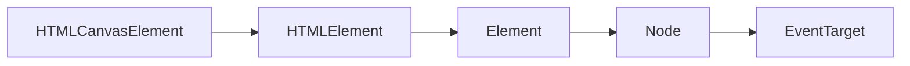

# Canvas

En introduktion till rasterbaserad mjukvarurendering med Canvas.

---

## Introduktion

- Canvas-teknologin kan användas för att skapa:
  - **Statisk rastergrafik**; *rendering av rasterbaserad grafik så som JPEG- och PNG-bilder.*
  - **Dynamisk rastergrafik**; *rendera rastergrafik som är resultatet av hämtad och/eller beräknad information. Exempelvis i form av grafer (stapeldiagram, tårtdiagram, mm.).*
  - **Interaktiv rastergrafik**; *rendera rastergrafik som användaren kan interagera med, exempelvis via mus- och/eller fingerinteraktion.*
  - **Applikationer**; renderar en applikation som baseras på JavaScript, exempelvis video- och/eller musikströmmningsmjukvara.
  - **Spel**; *rendera spel i två eller tre dimensioner.*

---

### Historia

- Introducerades 2004 av Apple som en del av deras Mac OS X WebKit.
- Adopterades något år senare av Mozilla och Opera.
  - Microsoft var sena med att stödja teknologin; *introducerades först i Internet Explorer 9 (tidigare versioner kräver tredjepartsbibliotek).*
- Standardiserades 2015 av WHATWG som en del av HTML5-standarden; *var menad som en alternativ teknologi till Adobe Flash-plattformen.*

---

### Beskrivning

- Canvas är någt av ett modeord; *något som ofta resulterar i tvetydliga definitioner om vad "Canvas" faktiskt innebär.*
- En "Canvas" består av en rektangulär tvådimentionell yta som...
  - Är ett HTML-element och representeras av taggarna `<canvas>` och `</canvas>.`
  - Har en begränsad, förbestämd storlek.
  - Anger sin storlek i pixlar.
  - Har sitt origo i det övre vänstra hörnet.
  - Är begrensad till rastergrafik.

---

### Struktur

- Canvas-teknologin består i huvudsak av två saker:
  - **HTML-element**; *en HTML-representation i form av `HTMLCanvasElement`, och kan deklareras via elementet `<canvas>`.*
  - **JavaScript-APIer**; *primärt två JavaScript-APIer - `CanvasRenderingContext2D` och `WebGLRenderingContext`. Dessa APIer används för att via JavaScript, rendera rastergrafik till ett befintligt `HTMLCanvasElement`.*
- Canvas-teknologin är således en kombination av HTML-element och samverkande JavaScript-APIer.
- Under exekvering "parkopplas" ett `HTMLCanvasElement`, med ett JavaScript-API som används för att rendera grafik till elementet; dessa APIer benämns ofta som kontexter (`RenderingContext`)

---

```mermaid
graph BT
subgraph DOM
	HTMLCanvasElement
end
subgraph JavaScript
CanvasRenderingContext2D -. Draws to.. .-> HTMLCanvasElement
script(Application code) -- Provides instructions to.. --- CanvasRenderingContext2D
end
```

*Fig. JavaScript används för att via `CanvasRenderingContext2D` (eller annan renderingskontext), instruera vad som skall renderas till `HTMLCanvasElement`. Notera att "Application code" motsvarar den programkod som representerar den faktiska applikationen.*

---

### Renderingskontexter

- En `HTMLCanvasElement` är begränsad till en renderingskontext; *en kontext erhålls via `HTMLCanvasElement.getContext()` och måste vara en av följande:*
  - `"2D"`; *representeras av ett `CanvasRenderingContext2D` och används för rendering av tvådimensionell rastergrafik.*
  - `"webgl"`; *representeras av ett `WebGLRenderingContext ` och används för att rendera tredimensionell grafik via `WebGL` (OpenGL ES 2.0).*
  - `"webgl2"`; *representeras av ett `WebGLRenderingContext ` och används för att rendera tredimensionell grafik via `WebGL` (OpenGL ES 3.0).*
  - `"bitmaprenderer";` *representeras av en `ImageBitmapRenderingContext` och används för att ersätta innehållet av ett `HTMLCanvasElement`, med angiven `ImageBitmap`.*
- Kursen innefattar enbart tvådimensionell grafik med `CanvasRenderingContext2D`.

---

## HTMLCanvasElement

- Är den datatyp som representerar det faktiska Canvas-elementet, dvs. det objekt som har förmåga att placeras i aktuell webbsidas HTML-/DOM-struktur.
- Då `HTMLCanvasElement` ärver från `HTMLElement`..
  - Kan det inte skapas med `new`-operatorn; *använd `document.createElement("canvas")` för att skapa en ny instans av `HTMLCanvasElement`.*
  - Kan det applicera "globala HTML-attribut"; *exempelvis `id` och `class`. För mer information se Mozillas (2021) fullständiga dokumentation.*
  - Kan hämtas via `document` och deklareras via `<canvas></canvas>`.
  - Har det stöd för händelselyssnare i och med arvet från `EventTarget`.
- Elementet deklarerar två nya attribut; *`width` och `height` - maximal upplösning för Canvas-element, dikteras av aktuell webbläsare.*

---



*Fig. Ovanstående figur illustrerar Canvas-elementets typning med tillhörande arvsled. Notera hur mycket Canvas-elementet har gemensamt med andra HTML-element.*

---

```javascript
<canvas id="app-canvas" width="800px" height="600px">
    <h2>Error: Canvas unsupported</h2>
    <p>Your browser does not support the canvas element.</p>
</canvas>
```

*Fig. Exempel på deklaration av `HTMLCanvasElement` via HTML. Elementet deklareras med `id="app-canvas"` och en storlek på 800 x 600 pixlar. Vidare används HTML 5s "fallback-stöd" för att förmedla information till webbläsare som inte har stöd för Canvas-elementet.*

---

### Egenskaper

- Objekt av `HTMLCanvasElement` innehåller följande egenskaper: 
  - `HTMLCanvasElement.width`; *elementets bredd, samma som eventuellt `width`-attribut (standardvärde 300).*
  - `HTMLCanvasElement.height`; *elementets höjd, samma som eventuellt `height`-attribut (standardvärde 150).*

---

### Metoder

- `HTMLCanvasElement.getContext(contextID)`; *används för att parkoppla `HTMLCanvasElement` med en `RenderingContext`.*
- `HTMLCanvasElement.toDataURL(type)`; *returnerar en Data URL innehållande canvas-elementets aktuella innehåll.*
- `HTMLCanvasElement.toBlob(callback)`; *skapar ett Blob-objekt som representerar en fil innehållande canvas-elementets aktuella innehåll, samt aktiverar en callback-funktion som refererar tillbaka till den skapade filen.*
- `HTMLCanvasElement.transferControlToOffscreen()`; *skapar och retunerar en ny `OffscreenCanvas` som parkopplas med aktuellt canvas-element.*

---

## CanvasRenderingContext2D

- Då `CanvasRenderingContext2D` är ett relativt omfattande API, summeras innehållet i följande grupperingar:
  - **Objekt**; *summerande beskrivning av `CanvasRenderingContext2D`-objektet.*
  - **Former**; *beskriver hur grundläggande geometriska former kan ritas.*
  - **Text**; *beskriver hur text kan stilsättas och ritas.*
  - **Bilder**; *beskriver hur bilder kan ritas och/eller manipuleras.*

---

### Objekt

- När ett `HTMLCanvasElement` parkopplats med ett `CanvasRenderingContext2D`-objekt, sker samtliga ritoperationer via `CanvasRenderingContext2D`-objektet.
- Objektet fungerar som en FSM[^1] och renderar därför alltid utifrån sitt aktuella tillstånd; *Javacript-kod används för att påverka objektets tillstånd och således rendera önskvärt resultat.*
- Objektet erbjuder metoderna `CanvasRenderingContext2D.save()` och `CanvasRenderingContext2D.restore()` för att spara, eller återställa till föregående sparade tillstånd.

[^1]: Finite-state machine (FSM) - mekanism som alltid kan befinna sig i ett av `n` antal möjliga tillstånd.

---

### Former

- **Rektanglar**; *APIet innehåller ett antal metoder som dedikerats rendering av rektanglar.*
- **Övriga**; *övriga former kan renderas via "banor"(`Path`) och "underliggande banor" (`Subpath`). En ny bana representerar en ny form, underliggande banor är punkter som utgör formen. *

---

#### Rektanglar

- `CanvasRenderingContext2D.fillRect(x,y,w,h)`; *ritar en rektangel utifrån aktuell fyllningsfärg (`CanvasRenderingContext2D.fillStyle`).*
- `CanvasRenderingContext2D.strokeRect(x,y,w,h)`; *ritar konturen av en rektangel utifrån aktuellt linjeformat.*
- `CanvasRenderingContext2D.clearRect(x,y,w,h)`; *rensar samtliga pixlar inom en angiven rektangel. Rensar defineras som att ge respektive pixel värdet noll, angivet i hexadecimal (`0x0`).*

---

```javascript
ctx.fillStyle = "rgba(255, 0, 0, 1.0)";
ctx.fillRect(25, 25, 100, 100);

ctx.strokeStyle = "#00FF00";
ctx.strokeRect(200, 25, 50, 50);
```

*Fig. Exempelkod som renderar en fylld röd kvadrat och konturen av en grön kvadrat. Notera hur `DOMString` används för att bestämma fyllnads- och linjefärg.*

---

#### Övriga

- `CanvasRenderingContext2D.beginPath()`; *nollställer aktuell bana.*
- `CanvasRenderingContext2D.closePath()`; *avslutar aktuell underliggande bana och påbörjar en ny.*
- `CanvasRenderingContext2D.moveTo(x,y)`; *skapar en ny underliggande bana till angiven position (`x` och `y`).*
- `CanvasRenderingContext2D.fill()`; *färgfyller aktuell underliggande bana med aktuell fyllningsfärg (`CanvasRenderingContext2D.fillStyle`).*
- `CanvasRenderingContext2D.stroke()`; *ritar konturen av aktuell underliggande bana med aktuellt linjeformat.*
- `CanvasRenderingContext2D.lineTo(x,y)`; *ritar en rak linje mellan aktuell och angiven position.*
- `CanvasRenderingContext2D.rect(x,y,w,h)`; *lägger till en ny underliggande bana som representerar en rektangel.*
- `CanvasRenderingContext2D.arc(x,y,radius,startAbgle,endAngle,anticlockwise)`; *ritar en linje runt angiven cirkel, men enbart innom angiven vinkel.*
- `CanvasRenderingContext2D.arcTo(x1,y1,x2,y2,radius)`; *lägger till en underliggande bana som beskriver en böjd linje, där börjningen defineras utifrån angiven radie.*
- `CanvasRenderingContext2D.bezierCurveTo(cp1x,cp1y,cp2x,cp2y,x,y)`; *lägger till en Bézier-kurva med angivna kontrollpunkter.*
- `CanvasRenderingContext2D.quadraticCurveTo(cpx,cpy,x,y)`; *lägger till en kvadratisk Bézier-kurva med angivna kontrollpunkter.*

---

```javascript
ctx.strokeStyle = "rgb(0, 0, 255)";
ctx.beginPath();
ctx.moveTo(100, 100);
ctx.lineTo(200, 200);
ctx.stroke();
```

*Fig. Renderar en blå linje mellan två punkter.*

---

### Text

- APIet innehåller egenskaper och metoder för att rendera text till aktuellt Canvas-element.

---

#### Egenskaper

- `CanvasRenderingContext2D.font`; *`DOMString` som beskriver aktuellt typsnitt.*
- `CanvasRenderingContext2D.textAlign`; *aktuell textjustering. Möjliga värden: `"start"` (standardvärde),  `"end"`, `"left"`, `"right"` eller `"center"`.*
- `CanvasRenderingContext2D.textBaseline`; aktuell baslinjejustering. Möjliga värden: `"top"`, `"hanging"`, `"middle"`, `"alphabetic"` (standardvärde), `"ideographic"` eller `"bottom"`.
- `CanvasRenderingContext2D.direction`; *aktuell direktionalitet. Möjliga värden: `"ltr"`, `"rtl"` eller `"inherit"` (standardvärde).*

---

#### Metoder

- `CanvasRenderingContext2D.fillText(text,x,y,maxWidth)`; *ritar text på angiven position och med möjlig maximal bredd.* 
- `CanvasRenderingContext2D.strokeText(text,x,y,maxWidth)`; *renderar konturerna av `text` på angiven position.*
- `CanvasRenderingContext2D.measureText(text)`; *retunerar ett `TextMetrics`-objekt innehållande information om angiven text renderingsstorlek. Resultatet baseras på ``CanvasRenderingContext2D` aktuella tillstånd gällande text.*

---

```javascript
ctx.font = "50px serif";
ctx.fillText("1ME333: Interaktionsdesign 3", 100, 50);
```

*Fig. Exempel som renderar text.*

---

### Bilder

- Inviduella pixlar kan hämtas från en bild via `CanvasRenderingContext2D.getImageData(sx,sy,sw,sh)`; *metodanropet resulterar i ett `ImageData`-objekt, innehållande en `Uint8ClampedArray` som representerar hämtade pixlar.*
- Bilder (eller innehållet av en annan Canvas) kan ritas till Canvas via `CanvasRenderingContext2D.drawImage()`, som är en överlagrad[^2] metod:

```javascript
void ctx.drawImage(image, dx, dy);
void ctx.drawImage(image, dx, dy, dWidth, dHeight);
void ctx.drawImage(image, sx, sy, sWidth, sHeight, dx, dy, dWidth, dHeight);
```

*Fig. Illustrerar metoden `CanvasRenderingContext2D.drawImage` och dess överlagring.*

[^2]: Överlagrad - Då flera metoder använder samma namn, men varierar i antalet förväntade parametrar; *innebörden av metodanrop kan således variera beroende på antal bifogade parametrar.*

---

```javascript
var canvas = document.createElement("canvas");
var ctx = canvas.getContext("2d");
var img = new Image();
img.src = "https://...";
img.onload = function() {
  ctx.drawImage(img,50,20);
}
```

*Fig. Exempel som renderar `img` till `canvas`. Renderingen påbörjas först när `img` har laddats.*

---

## Arbetsmetodik

- Canvas-teknologin används vanligtvis med animerat och/eller dynamiskt innehåll; *här följer en lista med vanligt förekommande arbetsmetoder:*
  - Renderingsslinga (Render loop)
  - Blit(ting)
  - Visningslista (Display list)

---

### Renderingsslinga

- En renderingsslinga är en återupprepande process som ansvarar för att rendera innehållet av en applikation; *kan ske synkroniserat med enhetens uppdateringsfrekvens, eller via eget intervall.*
-  Bildrutor (frames) per sekund (FPS) är den måttenhet som vanligtvis är förknippad med en renderingsslinga.
- Inom kontexten av webbläsare kan en renderingsslinga skapas med:
  - `window.setInterval(func, delay)`; *exekverar en funktion efter förbestämt intervall. Är inte längre rekommenderad för renderingsslingor.*
  - `window.requestAnimationFrame(callback)`; *metod som låter en funktion ekekveras i samband med att webbläsaren renderar om sitt innehåll, renderingsslingan är således synkroniserad med värdmiljön.*

---

#### setTimeout

- Metod som påbörjar exekvering av tillhandahållen funktion efter ett förbestämt intervall; *parametrar att känna till:*
  - `function:Function`; *referens till den funktion som skall exekveras.*
  - `delay:number`; *fördröjning angivet i millisekunder.*
- Metoden retunerar ett `ID` som används via metoden `clearInterval()` för att stoppa processen.

```javascript
var id = window.setTimeout(function() {
  console.log("Hello World!");
}, 5000);

window.clearInterval(id);
```

*Fig. Exempel som skulle skriva ut `Hello World` i felsökningskonsollen var femte sekund, om det inte vore för anropet till `clearInterval()` som stoppar processen.*

---

#### requestAnimationFrame

- Metod som låter en funktion ekekveras i samband med att webbläsaren renderar om sitt innehåll.
- Metodens `callback`-funktion ges tillgång till ett `DOMHighResTimeStamp` (`step`) som beskriver hur lång tid som förflutigt sedan exekveringens början (time origin).

```javascript
function tick(step) {
  // repaint.
  window.requestAnimationFrame(tick);
}

window.requestAnimationFrame(tick);
```

*Fig. Exempel som skapar en renderingsslinga via `requestAnimationFrame`.*

---

### Blit

- Process där videominne kopieras från en plats till en annan i syfte att komponera en sammansatt bild; *metodik som användes i äldre persondatorer och spelkonsoler där all grafik hanterades av enhetens CPU.*
- Teorin bakom metodiken kan appliceras inom webbutveckling med:
	- **Canvas**; *kopiera pixlar från en atlas till en slutdestination, vanligtvis representerad av skärmen.*
	- **CSS**; *använd css för att visa delar av en atlas.*

---

#### Canvas

```javascript
ctx.drawImage(
	sprite.texture,
	sprite.animation.x,
	sprite.animation.y,
	sprite.animation.width
	sprite.animation.height,
	sprite.x,
	sprite.y,
	sprite.width,
	sprite.height
);
```

*Fig. Metoden `drawImage` är lämpligt utformad för att rendera ett objekt vars grafik hämtas från en atlas. I detta exempel motsvarar `animation`-objektet vad som skall visas av aktuell atlas (`texture`).*

---

#### CSS

```css
#save-btn {
    background-image: url("...");
    background-position: 0 0;
    height: 24px;
    width: 150px;
}

#save-btn:hover {
    background-position: 0 24px;
}
```

*Fig. Exempel som representerar en knapp. Knappens grafik lagras i en bildfil (atlas). När användaren för muspekaren över knappen, visas en specifik del av atlasen som representerar en "hover"-effekt.*

---

### Visningslista

- En visningslista (`Display List`) är ett koncept inom datavetenskap där ritinstruktioner lagras, och exekveras enligt listans turordning; *detta koncept kan användas för att rendera objekt med Canvas.*
- Konceptet kan användas rekursivt i syfte att skapa flerdimensionella listor.

---

## Sammanfattning

- Canvas-teknologin består av ett `HTMLCanvasElement` med tillhörande JavaScript-APIer.
- Med Canvas-teknologin är det möjligt att via mjukvara, dynamiskt rita rastergrafik till tillgängligt Canvas-element.
- En renderingsslinga kan användas för att systematiskt rita till Canvas-element.

---

## Referenser

Mozilla. (2021). *Global attributes - HTML: HyperText Markup Language | MDN*. [online] Available at: https://developer.mozilla.org/en-US/docs/Web/HTML/Global_attributes

Web Hypertext Application Technology Working Group (WHATWG). (2021). *HTML Standard*. [online] Available at: https://html.spec.whatwg.org/multipage/canvas.html